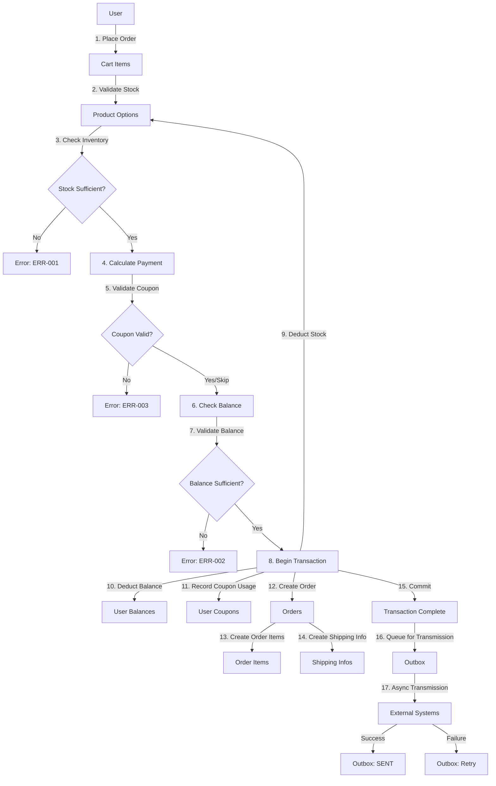
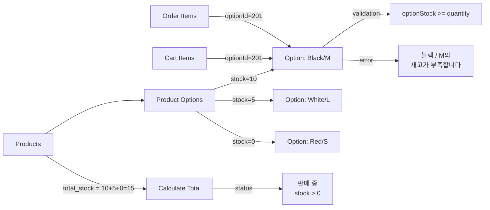
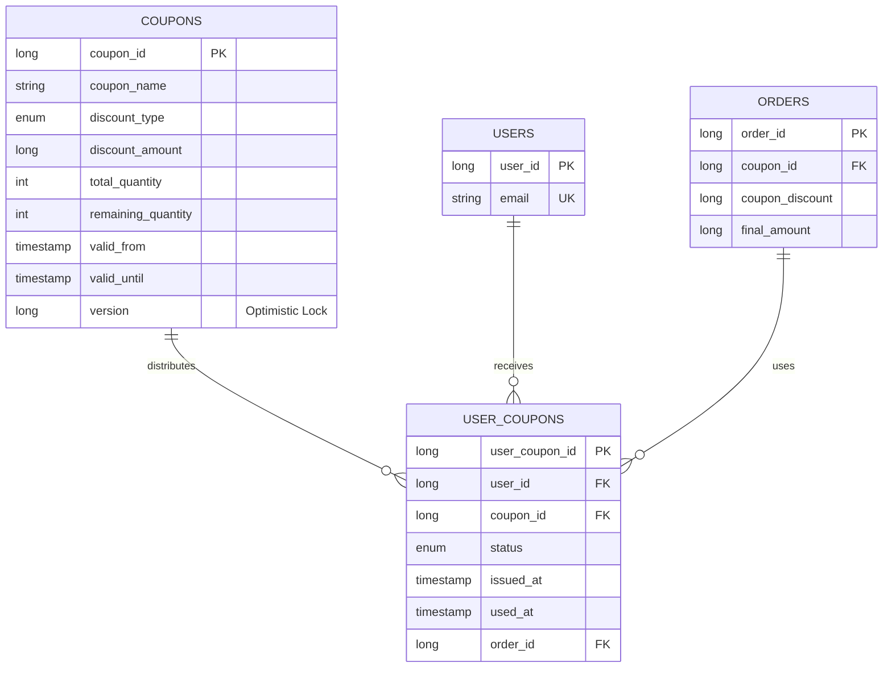
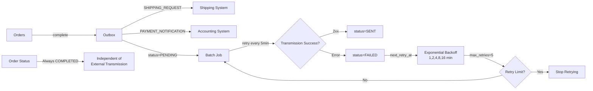

# E-Commerce Platform Data Models & ERD

## 1. Data Model Overview

This document describes all data entities (tables), their attributes, relationships, and constraints based on the requirements specification.

### 1.1 Entity Summary

| Entity | Purpose | Key Feature |
|--------|---------|-------------|
| users | User accounts | Authentication, balance tracking |
| user_balances | User wallet system | In-app payment balance |
| balance_history | Balance audit trail | Transaction history |
| products | Product catalog | Product information, pricing |
| product_options | Product variants | Size, color, storage options |
| product_view_statistics | Popularity tracking | Daily view counts |
| carts | Shopping carts | Per-user cart |
| cart_items | Cart line items | Product + Option combination |
| orders | Order records | Completed transactions |
| order_items | Order line items | Items in order |
| shipping_infos | Shipping details | Delivery information |
| coupons | Coupon definitions | Coupon policies |
| user_coupons | Coupon issuance | Per-user coupon tracking |
| outbox | External transmission queue | Retry mechanism for external systems |

---

## 2. Entity Definitions

### 2.1 Users Table

**Purpose**: User account management

```
Entity: Users
├─ user_id (PK) - Long
├─ email (UNIQUE) - String
├─ password_hash - String
├─ name - String
├─ phone - String
├─ status - Enum (ACTIVE, INACTIVE, SUSPENDED)
├─ created_at - Timestamp
└─ updated_at - Timestamp
```

**Attributes**:
- `user_id`: Primary key, auto-increment
- `email`: Unique email address
- `password_hash`: Hashed password (never plain text)
- `name`: User's display name
- `phone`: Contact phone number
- `status`: Account status (ACTIVE = normal, INACTIVE = suspended, SUSPENDED = locked)
- `created_at`: Account creation timestamp
- `updated_at`: Last modification timestamp

**Constraints**:
- UNIQUE on email
- NOT NULL on email, password_hash, name

**Indexes**:
- PRIMARY KEY (user_id)
- UNIQUE INDEX (email)
- INDEX (status)

---

### 2.2 User Balances Table

**Purpose**: Track user's in-app wallet balance

```
Entity: UserBalances
├─ balance_id (PK) - Long
├─ user_id (FK, UNIQUE) - Long
├─ balance - Long
├─ version (OL) - Long
├─ created_at - Timestamp
└─ updated_at - Timestamp
```

**Attributes**:
- `balance_id`: Primary key
- `user_id`: Foreign key to users (UNIQUE = one balance per user)
- `balance`: Current balance in KRW (use BIGINT for large numbers)
- `version`: Optimistic lock version for concurrent updates
- `created_at`: Record creation timestamp
- `updated_at`: Last update timestamp

**Constraints**:
- UNIQUE on user_id
- NOT NULL on balance
- Foreign key to users table

**Concurrency Control**:
- Optimistic locking via version column
- Update condition: `WHERE user_id = ? AND version = ?`

---

### 2.3 Balance History Table

**Purpose**: Audit trail for all balance changes

```
Entity: BalanceHistory
├─ history_id (PK) - Long
├─ user_id (FK) - Long
├─ transaction_type - Enum (CHARGE, DEDUCTION)
├─ amount - Long
├─ previous_balance - Long
├─ new_balance - Long
├─ order_id (FK) - Long
├─ description - String
├─ created_at - Timestamp
└─ (No updated_at - immutable record)
```

**Attributes**:
- `history_id`: Primary key
- `user_id`: Foreign key to users
- `transaction_type`: CHARGE (add balance) or DEDUCTION (payment from order)
- `amount`: Transaction amount
- `previous_balance`: Balance before transaction
- `new_balance`: Balance after transaction
- `order_id`: Related order (NULL if balance charge)
- `description`: Transaction description
- `created_at`: Transaction timestamp

**Constraints**:
- Foreign key to users (CASCADE DELETE)
- Foreign key to orders (SET NULL on delete)

**Indexes**:
- PRIMARY KEY (history_id)
- INDEX (user_id)
- INDEX (transaction_type)
- INDEX (created_at)

---

### 2.4 Products Table

**Purpose**: Product catalog management

```
Entity: Products
├─ product_id (PK) - Long
├─ product_name - String
├─ description - Text
├─ price - Long
├─ total_stock - Integer
├─ status - Enum (판매 중, 품절)
├─ created_at - Timestamp
├─ updated_at - Timestamp
└─ deleted_at (Soft Delete) - Timestamp
```

**Attributes**:
- `product_id`: Primary key, auto-increment
- `product_name`: Product name
- `description`: Detailed product description
- `price`: Base unit price in KRW
- `total_stock`: Calculated as SUM of all option stocks (not directly updated)
- `status`: "판매 중" (on sale) or "품절" (out of stock)
- `created_at`: Product creation timestamp
- `updated_at`: Last update timestamp
- `deleted_at`: Soft delete timestamp (NULL if active)

**Business Rules**:
- `total_stock = SUM(product_options.stock WHERE deleted_at IS NULL)` (calculated)
- `status = "품절" IF total_stock = 0 ELSE "판매 중"`
- Both updated automatically when option stocks change

**Constraints**:
- NOT NULL on product_name, price

**Indexes**:
- PRIMARY KEY (product_id)
- INDEX (status)
- INDEX (created_at)

**Soft Deletion**: Use `deleted_at` for logical deletion and audit trail

---

### 2.5 Product Options Table

**Purpose**: Manage product variants with independent stock tracking

```
Entity: ProductOptions
├─ option_id (PK) - Long
├─ product_id (FK) - Long
├─ name - String
├─ stock - Integer
├─ version (OL) - Long
├─ created_at - Timestamp
├─ updated_at - Timestamp
└─ deleted_at (Soft Delete) - Timestamp
```

**Attributes**:
- `option_id`: Primary key, auto-increment
- `product_id`: Foreign key to products
- `name`: Option name (e.g., "블랙 / M", "화이트 / L")
- `stock`: Current stock quantity for this option
- `version`: Optimistic lock version for concurrent stock updates (FRC-005)
- `created_at`: Record creation timestamp
- `updated_at`: Last update timestamp
- `deleted_at`: Soft delete timestamp

**Business Rules** (from 2.1.4):
- Each option maintains independent stock quantity
- `product.total_stock = SUM(option.stock)` (must be validated)
- Option stock cannot go negative: `stock >= 0`
- Option-level stock validation: `optionStock >= orderQuantity` (NOT product total)
- Error message format: "[Option Name]의 재고가 부족합니다"

**Constraints**:
- Foreign key to products (CASCADE DELETE)
- UNIQUE on (product_id, name) - prevents duplicate option names per product
- NOT NULL on product_id, name, stock

**Concurrency Control**:
- Optimistic locking via version column
- Update condition: `UPDATE SET stock = stock - ?, version = version + 1 WHERE option_id = ? AND version = ?`

**Indexes**:
- PRIMARY KEY (option_id)
- INDEX (product_id)
- INDEX (stock) - for availability queries
- UNIQUE INDEX (product_id, name)

---

### 2.6 Product View Statistics Table

**Purpose**: Track daily view counts for popular product ranking

```
Entity: ProductViewStatistics
├─ stat_id (PK) - Long
├─ product_id (FK) - Long
├─ view_date - Date
├─ view_count - Integer
├─ created_at - Timestamp
└─ updated_at - Timestamp
```

**Attributes**:
- `stat_id`: Primary key
- `product_id`: Foreign key to products
- `view_date`: Date of the view count
- `view_count`: Number of views on that date
- `created_at`: Record creation timestamp
- `updated_at`: Last update timestamp

**Constraints**:
- Foreign key to products (CASCADE DELETE)
- UNIQUE on (product_id, view_date)

**Indexes**:
- PRIMARY KEY (stat_id)
- UNIQUE INDEX (product_id, view_date)
- INDEX (view_date)

---

### 2.7 Carts Table

**Purpose**: Per-user shopping cart

```
Entity: Carts
├─ cart_id (PK) - Long
├─ user_id (FK, UNIQUE) - Long
├─ total_items - Integer
├─ total_price - Long
├─ created_at - Timestamp
└─ updated_at - Timestamp
```

**Attributes**:
- `cart_id`: Primary key, auto-increment
- `user_id`: Foreign key to users (UNIQUE = one cart per user)
- `total_items`: Count of distinct items in cart
- `total_price`: Sum of all item prices (denormalized for performance)
- `created_at`: Cart creation timestamp
- `updated_at`: Last modification timestamp

**Business Rules**:
- Each user has exactly one cart
- Cart items do NOT impact inventory (BR-03)
- Inventory only decreases at order creation (FRC-005)

**Constraints**:
- UNIQUE on user_id
- Foreign key to users (CASCADE DELETE)

**Indexes**:
- PRIMARY KEY (cart_id)
- UNIQUE INDEX (user_id)

---

### 2.8 Cart Items Table

**Purpose**: Line items in shopping cart

```
Entity: CartItems
├─ cart_item_id (PK) - Long
├─ cart_id (FK) - Long
├─ product_id (FK) - Long
├─ option_id (FK) - Long
├─ quantity - Integer
├─ unit_price - Long
├─ total_price (Generated) - Long
├─ created_at - Timestamp
└─ updated_at - Timestamp
```

**Attributes**:
- `cart_item_id`: Primary key, auto-increment
- `cart_id`: Foreign key to carts
- `product_id`: Foreign key to products
- `option_id`: Foreign key to product_options (CRITICAL - required field)
- `quantity`: Item quantity
- `unit_price`: Product price at time of addition (snapshot for audit trail)
- `total_price`: GENERATED COLUMN = quantity * unit_price
- `created_at`: Record creation timestamp
- `updated_at`: Last modification timestamp

**Business Rules** (from 2.1.4 & 2.2.1):
- Option ID is REQUIRED (user must select specific option)
- Same product with different options = separate cart items
- Unique constraint on (cart_id, product_id, option_id)
- Cart does NOT affect inventory (BR-03)

**Constraints**:
- Foreign key to carts (CASCADE DELETE)
- Foreign key to products (CASCADE DELETE)
- Foreign key to product_options (CASCADE DELETE)
- UNIQUE on (cart_id, product_id, option_id)
- NOT NULL on option_id

**Indexes**:
- PRIMARY KEY (cart_item_id)
- INDEX (cart_id)
- UNIQUE INDEX (cart_id, product_id, option_id)

---

### 2.9 Orders Table

**Purpose**: Order records for completed transactions

```
Entity: Orders
├─ order_id (PK) - Long
├─ user_id (FK) - Long
├─ order_status - Enum (COMPLETED, PENDING, FAILED)
├─ coupon_id (FK) - Long
├─ coupon_discount - Long
├─ subtotal - Long
├─ final_amount - Long
├─ version (OL) - Long
├─ created_at - Timestamp
└─ updated_at - Timestamp
```

**Attributes**:
- `order_id`: Primary key, auto-increment
- `user_id`: Foreign key to users
- `order_status`: COMPLETED (successful), PENDING (in progress), FAILED (error)
- `coupon_id`: Applied coupon (nullable)
- `coupon_discount`: Discount amount from coupon
- `subtotal`: Sum of all items (products × quantity)
- `final_amount`: subtotal - coupon_discount (amount actually paid)
- `version`: Optimistic lock for concurrent updates
- `created_at`: Order creation timestamp
- `updated_at`: Last update timestamp

**Business Rules**:
- Order moves to COMPLETED immediately upon successful transaction (FRC-007)
- External transmission (FRC-010) is asynchronous and separate
- External transmission failure does NOT change order status (BR-17)

**Constraints**:
- Foreign key to users (CASCADE DELETE)
- Foreign key to coupons (SET NULL on delete)
- NOT NULL on user_id, subtotal, final_amount

**Indexes**:
- PRIMARY KEY (order_id)
- INDEX (user_id)
- INDEX (order_status)
- INDEX (created_at)

---

### 2.10 Order Items Table

**Purpose**: Line items in completed orders

```
Entity: OrderItems
├─ order_item_id (PK) - Long
├─ order_id (FK) - Long
├─ product_id (FK) - Long
├─ option_id (FK) - Long
├─ product_name (Snapshot) - String
├─ option_name (Snapshot) - String
├─ quantity - Integer
├─ unit_price - Long
├─ total_price (Generated) - Long
└─ created_at - Timestamp
```

**Attributes**:
- `order_item_id`: Primary key, auto-increment
- `order_id`: Foreign key to orders
- `product_id`: Foreign key to products
- `option_id`: Foreign key to product_options
- `product_name`: Snapshot of product name at order time (audit trail)
- `option_name`: Snapshot of option name at order time (audit trail)
- `quantity`: Ordered quantity
- `unit_price`: Price paid per unit
- `total_price`: GENERATED COLUMN = quantity * unit_price
- `created_at`: Record creation timestamp

**Business Rules**:
- Snapshots preserve historical data if products are deleted/modified
- Includes option_id for tracking which variant was ordered (FRC-007)
- Essential for external system transmission (FRC-010)

**Constraints**:
- Foreign key to orders (CASCADE DELETE)
- Foreign key to products (RESTRICT DELETE - prevent accidental data loss)
- Foreign key to product_options (RESTRICT DELETE)

**Indexes**:
- PRIMARY KEY (order_item_id)
- INDEX (order_id)

---

### 2.11 Shipping Infos Table

**Purpose**: Shipping and delivery details for orders

```
Entity: ShippingInfos
├─ shipping_id (PK) - Long
├─ order_id (FK, UNIQUE) - Long
├─ recipient_name - String
├─ recipient_phone - String
├─ shipping_address - String
├─ shipping_status - Enum (PENDING, SHIPPED, DELIVERED, FAILED)
├─ external_order_id - String
├─ created_at - Timestamp
└─ updated_at - Timestamp
```

**Attributes**:
- `shipping_id`: Primary key
- `order_id`: Foreign key to orders (UNIQUE = one shipping info per order)
- `recipient_name`: Recipient's name
- `recipient_phone`: Recipient's phone number
- `shipping_address`: Full shipping address
- `shipping_status`: PENDING, SHIPPED, DELIVERED, or FAILED
- `external_order_id`: Tracking ID from external shipping system
- `created_at`: Record creation timestamp
- `updated_at`: Last update timestamp

**Constraints**:
- UNIQUE on order_id
- Foreign key to orders (CASCADE DELETE)

**Indexes**:
- PRIMARY KEY (shipping_id)
- INDEX (shipping_status)

---

### 2.12 Coupons Table

**Purpose**: Coupon policy definitions

```
Entity: Coupons
├─ coupon_id (PK) - Long
├─ coupon_name - String
├─ description - Text
├─ discount_type - Enum (FIXED_AMOUNT, PERCENTAGE)
├─ discount_amount - Long
├─ discount_rate - Decimal
├─ min_purchase_amount - Long
├─ max_usage_per_user - Integer
├─ total_quantity - Integer
├─ remaining_quantity - Integer
├─ valid_from - Timestamp
├─ valid_until - Timestamp
├─ is_active - Boolean
├─ version (OL) - Long
├─ created_at - Timestamp
└─ updated_at - Timestamp
```

**Attributes**:
- `coupon_id`: Primary key, auto-increment
- `coupon_name`: Coupon display name
- `description`: Coupon description
- `discount_type`: FIXED_AMOUNT or PERCENTAGE
- `discount_amount`: Fixed discount in KRW (if FIXED_AMOUNT)
- `discount_rate`: Discount percentage (if PERCENTAGE)
- `min_purchase_amount`: Minimum purchase required for coupon use
- `max_usage_per_user`: Maximum uses per user (typically 1)
- `total_quantity`: Total issued quantity limit
- `remaining_quantity`: Remaining available coupons (decrements on issuance)
- `valid_from`: Start of validity period
- `valid_until`: End of validity period
- `is_active`: Active/inactive flag
- `version`: Optimistic lock version for concurrent issuance (FRC-008)
- `created_at`: Coupon creation timestamp
- `updated_at`: Last update timestamp

**Business Rules** (from section 2.3):
- Coupon valid if: `is_active = true AND NOW() BETWEEN valid_from AND valid_until`
- Issuance check: `remaining_quantity > 0` (atomic decrement required)
- Concurrency: prevent race conditions during simultaneous issuance (BR-09, BR-10)

**Constraints**:
- NOT NULL on coupon_name, discount_type, total_quantity, remaining_quantity

**Concurrency Control**:
- Optimistic locking via version column
- Update condition: `UPDATE SET remaining_quantity = remaining_quantity - 1, version = version + 1 WHERE coupon_id = ? AND version = ?`

**Indexes**:
- PRIMARY KEY (coupon_id)
- INDEX (is_active)
- INDEX (valid_from, valid_until)

---

### 2.13 User Coupons Table

**Purpose**: Track coupon issuance and usage per user

```
Entity: UserCoupons
├─ user_coupon_id (PK) - Long
├─ user_id (FK) - Long
├─ coupon_id (FK) - Long
├─ status - Enum (ACTIVE, USED, EXPIRED)
├─ used_at - Timestamp
├─ order_id (FK) - Long
└─ issued_at - Timestamp
```

**Attributes**:
- `user_coupon_id`: Primary key, auto-increment
- `user_id`: Foreign key to users
- `coupon_id`: Foreign key to coupons
- `status`: ACTIVE (not used), USED (applied to order), EXPIRED (past validity)
- `used_at`: Timestamp when coupon was used (NULL if not used)
- `order_id`: Order that used the coupon (NULL if not used)
- `issued_at`: Coupon issuance timestamp

**Business Rules**:
- UNIQUE constraint on (user_id, coupon_id) enforces `max_usage_per_user` (BR-12)
- Status transitions: ACTIVE → USED (on order creation) or EXPIRED (after valid_until)
- Each coupon can be issued to a user only once

**Constraints**:
- UNIQUE on (user_id, coupon_id)
- Foreign key to users (CASCADE DELETE)
- Foreign key to coupons (CASCADE DELETE)
- Foreign key to orders (SET NULL on delete)

**Indexes**:
- PRIMARY KEY (user_coupon_id)
- UNIQUE INDEX (user_id, coupon_id)
- INDEX (user_id)
- INDEX (status)

---

### 2.14 Outbox Table

**Purpose**: External system transmission queue with retry mechanism

```
Entity: Outbox
├─ outbox_id (PK) - Long
├─ order_id (FK) - Long
├─ message_type - Enum (SHIPPING_REQUEST, PAYMENT_NOTIFICATION)
├─ payload - JSON
├─ status - Enum (PENDING, SENT, FAILED)
├─ retry_count - Integer
├─ max_retries - Integer
├─ last_retry_at - Timestamp
├─ next_retry_at - Timestamp
├─ error_message - Text
├─ created_at - Timestamp
└─ updated_at - Timestamp
```

**Attributes**:
- `outbox_id`: Primary key, auto-increment
- `order_id`: Foreign key to orders
- `message_type`: SHIPPING_REQUEST or PAYMENT_NOTIFICATION
- `payload`: JSON serialized message data (contains order information)
- `status`: PENDING (awaiting transmission), SENT (successfully sent), FAILED (transmission failed)
- `retry_count`: Number of retry attempts made
- `max_retries`: Maximum retry attempts (default 5)
- `last_retry_at`: Timestamp of last retry attempt
- `next_retry_at`: When next retry should occur (calculated per strategy)
- `error_message`: Last error message from external system
- `created_at`: Record creation timestamp
- `updated_at`: Last update timestamp

**Retry Strategy** (FRC-010):
- Initial status: PENDING
- Exponential backoff: 1min, 2min, 4min, 8min, 16min
- Triggered by: Batch job every 5 minutes OR async job consumer
- Success: Move to SENT when external system returns 2xx
- Failure: Increment retry_count, calculate next_retry_at, update error_message

**Business Rules**:
- Order data only (from requirement 2.4): includes order info, items, shipping details
- Excludes: inventory, coupon policy, user balance, other user data
- Created during order transaction (FRC-007) with PENDING status
- Asynchronous and separate from order processing (FRC-010, BR-16, BR-17)

**Constraints**:
- Foreign key to orders (CASCADE DELETE)
- NOT NULL on order_id, message_type, payload, status

**Indexes**:
- PRIMARY KEY (outbox_id)
- INDEX (status)
- INDEX (order_id)
- INDEX (next_retry_at, status) - for batch job queries

---

## 3. Entity Relationships

### 3.1 Relationship Diagram (Text-based)

```
                    users (1)
                      |
         _____________|_____________
        |             |             |
     (1:1)         (1:1)         (1:N)
        |             |             |
        v             v             v
    user_balances  carts         orders
                      |             |
                    (1:N)         (1:N)
                      |             |
                      v             v
                  cart_items    order_items
                      |             |
                      |             |
        (product_id, option_id)     |
                      |             |
                      v             v
                  products (1) ← ← ←
                      |
                    (1:N)
                      |
                      v
              product_options (1)
                      |
                  (1:N)
                      |
                      v
            product_view_stats

    coupons (1)
        |
      (1:N)
        |
        v
    user_coupons
        |
        |_____ (FK to users, coupons, orders)

    orders (1)
        |
    (1:N)
        |
        v
    shipping_infos, outbox
```

### 3.2 Relationship Definitions

#### 3.2.1 users ↔ user_balances (1:1)
```
Type: One-to-One
Cardinality: 1:1
Foreign Key: user_balances.user_id → users.user_id
Constraint: UNIQUE on user_id
Action: CASCADE DELETE
Purpose: Each user has exactly one balance account
```

#### 3.2.2 users ↔ carts (1:1)
```
Type: One-to-One
Cardinality: 1:1
Foreign Key: carts.user_id → users.user_id
Constraint: UNIQUE on user_id
Action: CASCADE DELETE
Purpose: Each user has exactly one shopping cart
```

#### 3.2.3 users ↔ orders (1:N)
```
Type: One-to-Many
Cardinality: 1:N
Foreign Key: orders.user_id → users.user_id
Action: CASCADE DELETE
Purpose: User can have multiple orders
Index: idx_order_user_id
```

#### 3.2.4 users ↔ user_coupons (1:N)
```
Type: One-to-Many
Cardinality: 1:N
Foreign Key: user_coupons.user_id → users.user_id
Action: CASCADE DELETE
Purpose: Track coupons issued to each user
Index: idx_user_coupon_user_id
```

#### 3.2.5 users ↔ balance_history (1:N)
```
Type: One-to-Many
Cardinality: 1:N
Foreign Key: balance_history.user_id → users.user_id
Action: CASCADE DELETE
Purpose: Audit trail of balance changes
```

#### 3.2.6 carts ↔ cart_items (1:N)
```
Type: One-to-Many
Cardinality: 1:N
Foreign Key: cart_items.cart_id → carts.cart_id
Action: CASCADE DELETE
Purpose: Cart contains multiple items
Unique Constraint: (cart_id, product_id, option_id)
Special Note: OPTION_ID IS REQUIRED (not nullable)
```

#### 3.2.7 products ↔ product_options (1:N)
```
Type: One-to-Many
Cardinality: 1:N
Foreign Key: product_options.product_id → products.product_id
Constraint: UNIQUE on (product_id, name)
Action: CASCADE DELETE
Purpose: Each product has multiple variants
Key Business Logic:
  - product.total_stock = SUM(product_options.stock)
  - product.status = '품절' IF total_stock = 0
```

#### 3.2.8 product_options ↔ cart_items (1:N)
```
Type: One-to-Many
Cardinality: 1:N
Foreign Key: cart_items.option_id → product_options.option_id
Action: CASCADE DELETE
Purpose: Track which product option is in cart
Critical Rule: Cart validation uses option_id, not product_id
```

#### 3.2.9 product_options ↔ order_items (1:N)
```
Type: One-to-Many
Cardinality: 1:N
Foreign Key: order_items.option_id → product_options.option_id
Action: RESTRICT DELETE
Purpose: Preserve order history
Reason: Cannot delete option if it appears in any order
```

#### 3.2.10 orders ↔ order_items (1:N)
```
Type: One-to-Many
Cardinality: 1:N
Foreign Key: order_items.order_id → orders.order_id
Action: CASCADE DELETE
Purpose: Order contains multiple items
```

#### 3.2.11 orders ↔ shipping_infos (1:1)
```
Type: One-to-One
Cardinality: 1:1
Foreign Key: shipping_infos.order_id → orders.order_id
Constraint: UNIQUE on order_id
Action: CASCADE DELETE
Purpose: Each order has exactly one shipping info
```

#### 3.2.12 orders ↔ outbox (1:N)
```
Type: One-to-Many
Cardinality: 1:N
Foreign Key: outbox.order_id → orders.order_id
Action: CASCADE DELETE
Purpose: Multiple messages per order (SHIPPING_REQUEST, PAYMENT_NOTIFICATION)
Critical Feature: Retry mechanism for external system transmission
```

#### 3.2.13 coupons ↔ user_coupons (1:N)
```
Type: One-to-Many
Cardinality: 1:N
Foreign Key: user_coupons.coupon_id → coupons.coupon_id
Unique Constraint: (user_id, coupon_id)
Action: CASCADE DELETE
Purpose: Track coupon issuances to users
Enforces: max_usage_per_user (typically 1)
```

#### 3.2.14 orders ↔ coupons (N:1)
```
Type: Many-to-One
Cardinality: N:1
Foreign Key: orders.coupon_id → coupons.coupon_id
Action: SET NULL on delete
Purpose: Order can apply one coupon
Optional: Not all orders use coupons
```

#### 3.2.15 orders ↔ user_coupons (1:N)
```
Type: One-to-Many
Cardinality: 1:N
Foreign Key: user_coupons.order_id → orders.order_id
Action: SET NULL on delete
Purpose: Track which order used which coupon
```

---

## 4. Mermaid ERD Diagrams

### 4.1 Complete System ERD

```mermaid
erDiagram
    USERS ||--|| USER_BALANCES : has
    USERS ||--|| CARTS : owns
    USERS ||--o{ ORDERS : places
    USERS ||--o{ USER_COUPONS : receives
    USERS ||--o{ BALANCE_HISTORY : generates

    CARTS ||--o{ CART_ITEMS : contains
    PRODUCTS ||--o{ PRODUCT_OPTIONS : has
    PRODUCTS ||--o{ PRODUCT_VIEW_STATISTICS : tracks

    CART_ITEMS }o--|| PRODUCTS : references
    CART_ITEMS }o--|| PRODUCT_OPTIONS : selects

    ORDERS ||--o{ ORDER_ITEMS : contains
    ORDERS ||--|| SHIPPING_INFOS : requires
    ORDERS ||--o{ OUTBOX : queues
    ORDERS }o--|| COUPONS : applies

    ORDER_ITEMS }o--|| PRODUCTS : references
    ORDER_ITEMS }o--|| PRODUCT_OPTIONS : includes

    COUPONS ||--o{ USER_COUPONS : distributes
    USER_COUPONS }o--|| ORDERS : uses

    BALANCE_HISTORY }o--|| ORDERS : tracks

    USERS {
        long user_id PK
        string email UK
        string password_hash
        string name
        string phone
        enum status
        timestamp created_at
        timestamp updated_at
    }

    USER_BALANCES {
        long balance_id PK
        long user_id FK UK
        long balance
        long version
        timestamp created_at
        timestamp updated_at
    }

    BALANCE_HISTORY {
        long history_id PK
        long user_id FK
        enum transaction_type
        long amount
        long previous_balance
        long new_balance
        long order_id FK
        string description
        timestamp created_at
    }

    PRODUCTS {
        long product_id PK
        string product_name
        text description
        long price
        int total_stock
        enum status
        timestamp created_at
        timestamp updated_at
        timestamp deleted_at
    }

    PRODUCT_OPTIONS {
        long option_id PK
        long product_id FK
        string name
        int stock
        long version
        timestamp created_at
        timestamp updated_at
        timestamp deleted_at
    }

    PRODUCT_VIEW_STATISTICS {
        long stat_id PK
        long product_id FK
        date view_date
        int view_count
        timestamp created_at
        timestamp updated_at
    }

    CARTS {
        long cart_id PK
        long user_id FK UK
        int total_items
        long total_price
        timestamp created_at
        timestamp updated_at
    }

    CART_ITEMS {
        long cart_item_id PK
        long cart_id FK
        long product_id FK
        long option_id FK
        int quantity
        long unit_price
        long total_price
        timestamp created_at
        timestamp updated_at
    }

    ORDERS {
        long order_id PK
        long user_id FK
        enum order_status
        long coupon_id FK
        long coupon_discount
        long subtotal
        long final_amount
        long version
        timestamp created_at
        timestamp updated_at
    }

    ORDER_ITEMS {
        long order_item_id PK
        long order_id FK
        long product_id FK
        long option_id FK
        string product_name
        string option_name
        int quantity
        long unit_price
        long total_price
        timestamp created_at
    }

    SHIPPING_INFOS {
        long shipping_id PK
        long order_id FK UK
        string recipient_name
        string recipient_phone
        string shipping_address
        enum shipping_status
        string external_order_id
        timestamp created_at
        timestamp updated_at
    }

    COUPONS {
        long coupon_id PK
        string coupon_name
        text description
        enum discount_type
        long discount_amount
        decimal discount_rate
        long min_purchase_amount
        int max_usage_per_user
        int total_quantity
        int remaining_quantity
        timestamp valid_from
        timestamp valid_until
        boolean is_active
        long version
        timestamp created_at
        timestamp updated_at
    }

    USER_COUPONS {
        long user_coupon_id PK
        long user_id FK
        long coupon_id FK
        enum status
        timestamp used_at
        long order_id FK
        timestamp issued_at
    }

    OUTBOX {
        long outbox_id PK
        long order_id FK
        enum message_type
        json payload
        enum status
        int retry_count
        int max_retries
        timestamp last_retry_at
        timestamp next_retry_at
        text error_message
        timestamp created_at
        timestamp updated_at
    }
```

### 4.2 Order Processing Flow ERD



### 4.3 Product & Inventory ERD



### 4.4 Coupon System ERD



### 4.5 External Integration ERD



---

## 5. Data Consistency Rules

### 5.1 Product & Inventory Consistency

```
INVARIANT 1: Product Total Stock
    products.total_stock = SUM(product_options.stock WHERE deleted_at IS NULL)

    Validation: Daily check
    Update trigger: When any option stock changes
```

```
INVARIANT 2: Product Status
    IF products.total_stock = 0 THEN status = '품절'
    ELSE status = '판매 중'

    Auto-update: When total_stock becomes 0 or > 0
```

```
INVARIANT 3: Option Stock Non-negativity
    product_options.stock >= 0 (always)

    Validation: At each stock deduction
    Enforcement: Optimistic lock with version check
```

### 5.2 Order Processing Consistency

```
INVARIANT 4: Order Atomicity
    BEGIN TRANSACTION
        - Stock deduction ✓
        - Balance deduction ✓
        - Order creation ✓
        - Coupon usage ✓
    COMMIT or ROLLBACK (all or nothing)
```

```
INVARIANT 5: Coupon Single-Use
    UNIQUE(user_id, coupon_id) in user_coupons

    Enforcement: Database constraint
    Validates: max_usage_per_user (typically 1)
```

```
INVARIANT 6: Balance Non-negativity
    user_balances.balance >= 0 (always)

    Validation: Before deduction
    Enforcement: Check before update
```

---

## 6. Key Indexes for Performance

### 6.1 Critical Indexes (Must Have)

```sql
-- Product queries (FRC-001)
CREATE INDEX idx_product_status ON products(status);
CREATE INDEX idx_product_created_at ON products(created_at);

-- Option lookup (FRC-002, FRC-005)
CREATE UNIQUE INDEX idx_product_option ON product_options(product_id, name);
CREATE INDEX idx_option_stock ON product_options(stock);

-- Cart operations
CREATE UNIQUE INDEX idx_cart_user ON carts(user_id);
CREATE INDEX idx_cart_items ON cart_items(cart_id);

-- Order queries (FRC-007, FRC-009)
CREATE INDEX idx_order_user ON orders(user_id);
CREATE INDEX idx_order_status ON orders(order_status);
CREATE INDEX idx_order_created ON orders(created_at);

-- Coupon operations (FRC-008)
CREATE INDEX idx_coupon_active ON coupons(is_active, valid_until);
CREATE UNIQUE INDEX idx_user_coupon ON user_coupons(user_id, coupon_id);

-- Balance operations (FRC-004, FRC-006)
CREATE UNIQUE INDEX idx_user_balance ON user_balances(user_id);

-- External transmission (FRC-010)
CREATE INDEX idx_outbox_status ON outbox(status, created_at);
CREATE INDEX idx_outbox_retry ON outbox(next_retry_at, status);
```

---

## 7. Summary

This data model supports:
- **Option-based inventory management** (product variants with independent stock)
- **Atomic order processing** (stock + balance + coupon in single transaction)
- **Asynchronous external integration** (separate from order completion)
- **Coupon management** (first-come-first-served with quantity control)
- **Audit trails** (balance history, soft deletes, order snapshots)
- **High concurrency** (optimistic locking, atomic updates)
- **Performance** (denormalization, strategic indexes, caching candidates)

---

## Version History

| Version | Date       | Changes |
|---------|------------|---------|
| 1.0 | 2025-10-28 | Initial data models with all entities, relationships, and constraints |