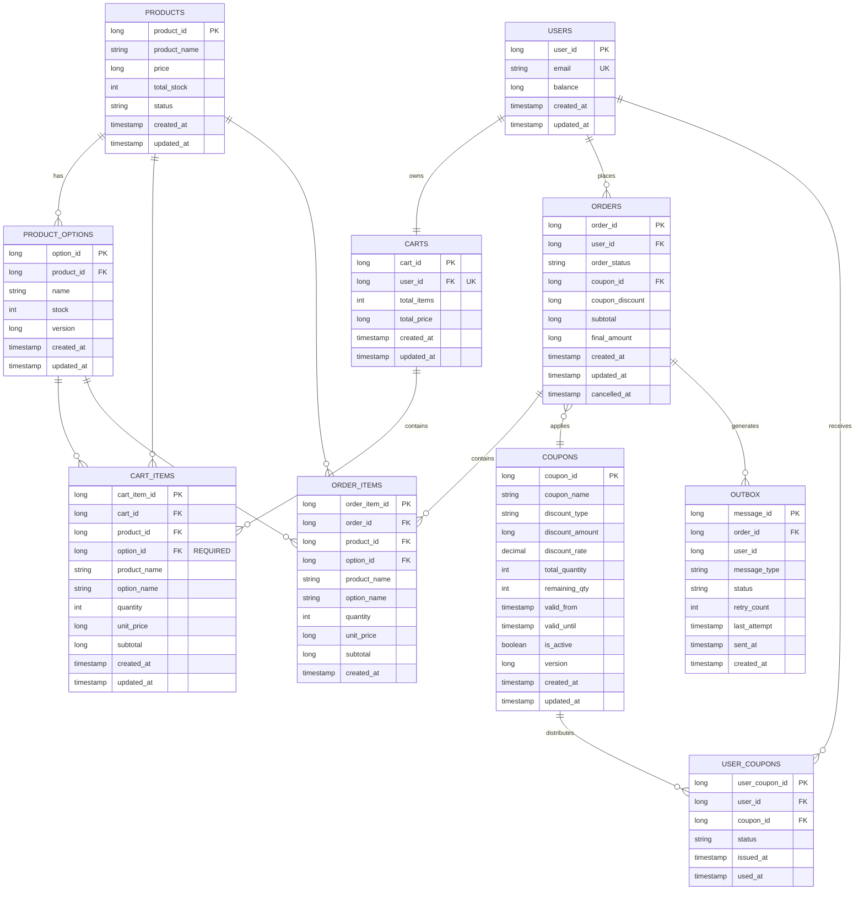

# E-Commerce 데이터 모델

> **Updated to match current domain entities as of 2025-11-12**
>
> This document reflects the actual domain model source code from `/src/main/java/com/hhplus/ecommerce/domain`. All entities, enums, and field definitions are synced with the current implementation.

## 개요

데이터 모델은 옵션 기반 재고를 갖춘 상품 카탈로그 관리, 쇼핑 카트 기능, 원자적 거래가 있는 주문 처리, 쿠폰 기반 할인을 지원합니다.
핵심 설계:
- 재고는 상품 옵션별로 추적되고 (option_id 기준)
- 카트는 재고에 영향을 주지 않으며
- 주문은 원자적 거래로 보장됨 (재고 + 잔액 + 쿠폰 + 외부 전송)
- 외부 시스템 연동은 Outbox 패턴으로 신뢰성 확보

---

## 엔티티 요약

| 엔티티 | 목적 | 관련 시퀀스 |
|--------|---------|-----------|
| **users** | 잔액이 있는 사용자 계정 | 3, 4, 7 |
| **products** | 상품 카탈로그 | 1, 2, 3 |
| **product_options** | 독립적인 재고가 있는 상품 변형 (낙관적 락) | 1, 2, 3, 4 |
| **carts** | 사용자별 쇼핑 카트 (1:1) | 2 |
| **cart_items** | 카트 라인 항목 (옵션 필수 + 스냅샷) | 2 |
| **orders** | 주문 (COMPLETED/CANCELLED) | 3, 6, 7 |
| **order_items** | 주문 라인 항목 (스냅샷 포함) | 3, 6, 7 |
| **coupons** | 할인 쿠폰 (FIXED_AMOUNT or PERCENTAGE) | 3, 5, 7 |
| **user_coupons** | 쿠폰 발급 및 사용 (UNUSED/USED/EXPIRED/CANCELLED) | 5, 7 |
| **outbox** | 외부 시스템 전송 메시지 큐 (비동기) | 3, 8 |

---

## 엔티티 정의

### users

| Field | Type | Nullable | Description |
|-------|------|----------|-------------|
| user_id | Long | NO | Primary Key (자동 증가) |
| email | String | NO | 이메일 (UNIQUE) |
| password_hash | String | YES | 비밀번호 해시 |
| name | String | YES | 사용자 이름 |
| phone | String | YES | 전화번호 |
| balance | Long | NO | 잔액 (기본값: 0) |
| created_at | Timestamp | NO | 계정 생성 시각 |
| updated_at | Timestamp | NO | 마지막 업데이트 시각 |

**핵심 규칙**:
- balance >= 0 (음수 불허)
- 신규 사용자는 초기 잔액 0으로 시작
- 이메일은 필수 (UNIQUE 제약)

---

### products

| Field | Type | Nullable | Description |
|-------|------|----------|-------------|
| product_id | Long | NO | Primary Key |
| product_name | String | NO | 상품명 |
| description | String | YES | 상품 설명 |
| price | Long | NO | 상품 가격 (단위: 원) |
| total_stock | Integer | NO | 총 재고 (계산 필드: SUM of option stocks) |
| status | ProductStatus | NO | 상품 상태 Enum (기본값: IN_STOCK) |
| created_at | Timestamp | NO | 생성 시각 |
| updated_at | Timestamp | NO | 마지막 업데이트 시각 |

**ProductStatus Enum**:
- IN_STOCK: 판매 중
- SOLD_OUT: 품절

**핵심 규칙**:
- 모든 옵션의 재고가 0이면 자동으로 SOLD_OUT 상태로 변경
- price > 0 (양수 필수)
- total_stock은 product_options의 재고 합계로 계산됨

**관계**:
- 1:N with product_options (옵션 관리)
- 1:N with cart_items (카트 항목)
- 1:N with order_items (주문 항목)

---

### product_options

| Field | Type | Nullable | Description |
|-------|------|----------|-------------|
| option_id | Long | NO | Primary Key |
| product_id | Long | NO | Foreign Key → products |
| name | String | NO | 옵션명 (예: "Black/M", "Red/L") |
| stock | Integer | NO | 재고 수량 (기본값: 0) |
| version | Long | NO | 낙관적 락 버전 (기본값: 1) |
| created_at | Timestamp | NO | 생성 시각 |
| updated_at | Timestamp | NO | 마지막 업데이트 시각 |

**핵심 규칙**:
- stock >= 0 (음수 불허)
- 옵션명은 필수
- 주문 또는 재고 차감 시 version +1 증가 (낙관적 락)
- UNIQUE(product_id, name) - 같은 상품 내에서 옵션명 중복 불가

**관계**:
- N:1 with products (상품)
- 1:N with cart_items (카트 항목)
- 1:N with order_items (주문 항목)

---

### carts

| Field | Type | Nullable | Description |
|-------|------|----------|-------------|
| cart_id | Long | NO | Primary Key |
| user_id | Long | NO | Foreign Key → users (UNIQUE) |
| total_items | Integer | NO | 총 항목 수 (계산 필드) |
| total_price | Long | NO | 총 금액 (계산 필드) |
| created_at | Timestamp | NO | 생성 시각 |
| updated_at | Timestamp | NO | 마지막 업데이트 시각 |

**핵심 규칙**:
- 사용자당 하나의 카트만 존재 (UNIQUE(user_id))
- total_items, total_price는 cart_items에서 계산되는 계산 필드
- 카트는 주문 시 재고에 영향을 주지 않음

**관계**:
- 1:1 with users (사용자)
- 1:N with cart_items (카트 항목)

---

### cart_items

| Field | Type | Nullable | Description |
|-------|------|----------|-------------|
| cart_item_id | Long | NO | Primary Key |
| cart_id | Long | NO | Foreign Key → carts |
| product_id | Long | NO | Foreign Key → products |
| option_id | Long | NO | Foreign Key → product_options (REQUIRED) |
| product_name | String | NO | 스냅샷: 현재 상품명 |
| option_name | String | NO | 스냅샷: 현재 옵션명 |
| quantity | Integer | NO | 수량 (>= 1) |
| unit_price | Long | NO | 단가 |
| subtotal | Long | NO | 소계 (계산 필드: unit_price * quantity) |
| created_at | Timestamp | NO | 생성 시각 |
| updated_at | Timestamp | NO | 마지막 업데이트 시각 |

**핵심 규칙**:
- option_id는 NOT NULL (옵션 선택 필수)
- product_name, option_name은 현재 값의 스냅샷 (상품 정보 변경 시에도 카트는 영향 X)
- quantity >= 1
- subtotal = unit_price * quantity

**관계**:
- N:1 with carts (카트)
- N:1 with products (상품)
- N:1 with product_options (옵션)

---

### orders

| Field | Type | Nullable | Description |
|-------|------|----------|-------------|
| order_id | Long | NO | Primary Key |
| user_id | Long | NO | Foreign Key → users |
| order_status | OrderStatus | NO | 주문 상태 Enum (기본값: COMPLETED) |
| coupon_id | Long | YES | Foreign Key → coupons (선택) |
| coupon_discount | Long | NO | 쿠폰 할인액 |
| subtotal | Long | NO | 소계 (할인 전) |
| final_amount | Long | NO | 최종 결제액 (subtotal - coupon_discount) |
| created_at | Timestamp | NO | 생성 시각 |
| updated_at | Timestamp | NO | 마지막 업데이트 시각 |
| cancelled_at | Timestamp | YES | 취소 시각 (취소 시에만 설정) |

**OrderStatus Enum**:
- COMPLETED: 주문 완료
- CANCELLED: 주문 취소

**핵심 규칙**:
- 주문은 COMPLETED 상태로 생성됨
- COMPLETED → CANCELLED 전환만 가능 (역방향 불가)
- final_amount >= 0
- coupon_discount >= 0
- cancelled_at는 취소 시에만 설정됨

**관계**:
- N:1 with users (사용자)
- N:1 with coupons (쿠폰, 선택) - 변경 사항 (2025-11-18): coupon_id는 쿠폰 사용을 추적하는 Foreign Key
- 1:N with order_items (주문 항목)
- 1:N with outbox (외부 전송 메시지)

**변경 사항 (2025-11-18): UserCoupon-Order 관계 제거**:
- 이전: user_coupons.order_id로 쿠폰 사용을 추적
- 현재: orders.coupon_id로 쿠폰 사용을 추적
- user_coupons는 "쿠폰 보유 상태"(UNUSED/USED/EXPIRED/CANCELLED)만 관리
- orders.coupon_id의 존재 여부로 쿠폰 사용을 판단

---

### order_items

| Field | Type | Nullable | Description |
|-------|------|----------|-------------|
| order_item_id | Long | NO | Primary Key |
| order_id | Long | NO | Foreign Key → orders |
| product_id | Long | NO | Foreign Key → products |
| option_id | Long | NO | Foreign Key → product_options |
| product_name | String | NO | 스냅샷: 주문 시점의 상품명 |
| option_name | String | NO | 스냅샷: 주문 시점의 옵션명 |
| quantity | Integer | NO | 주문 수량 (>= 1) |
| unit_price | Long | NO | 주문 시점의 단가 |
| subtotal | Long | NO | 소계 (계산 필드: unit_price * quantity) |
| created_at | Timestamp | NO | 생성 시각 |

**핵심 규칙**:
- product_name, option_name은 주문 시점의 스냅샷 (추후 상품 정보 변경 시에도 원래 가격 유지)
- quantity >= 1
- unit_price > 0
- subtotal = unit_price * quantity
- updatedAt 필드 없음 (생성 후 수정 불가)

**관계**:
- N:1 with orders (주문)
- N:1 with products (상품, 감사 추적용)
- N:1 with product_options (옵션, 감사 추적용)

---

### coupons

| Field | Type | Nullable | Description |
|-------|------|----------|-------------|
| coupon_id | Long | NO | Primary Key |
| coupon_name | String | NO | 쿠폰명 |
| description | String | YES | 쿠폰 설명 |
| discount_type | String | NO | 할인 유형 (FIXED_AMOUNT \| PERCENTAGE) |
| discount_amount | Long | NO | 정액 할인액 (기본값: 0) |
| discount_rate | BigDecimal | NO | 할인율 (기본값: 0.0) |
| total_quantity | Integer | YES | 총 발급 수량 |
| remaining_qty | Integer | YES | 남은 발급 수량 (원자적 감소) |
| valid_from | Timestamp | YES | 유효 기간 시작 |
| valid_until | Timestamp | YES | 유효 기간 종료 |
| is_active | Boolean | NO | 활성화 여부 (기본값: true) |
| version | Long | NO | 낙관적 락 버전 (기본값: 1) |
| created_at | Timestamp | NO | 생성 시각 |
| updated_at | Timestamp | NO | 마지막 업데이트 시각 |

**핵심 규칙**:
- discount_type이 FIXED_AMOUNT인 경우: discount_amount > 0
- discount_type이 PERCENTAGE인 경우: 0.0 <= discount_rate <= 1.0
- remaining_qty는 원자적으로 감소 (race condition 방지)
- version은 쿠폰 발급 시 +1 증가 (낙관적 락)
- is_active = false인 쿠폰은 발급 불가능

**관계**:
- 1:N with user_coupons (사용자 쿠폰)
- 0:N with orders (주문)

---

### user_coupons

| Field | Type | Nullable | Description |
|-------|------|----------|-------------|
| user_coupon_id | Long | NO | Primary Key |
| user_id | Long | NO | Foreign Key → users |
| coupon_id | Long | NO | Foreign Key → coupons |
| status | UserCouponStatus | NO | 쿠폰 상태 Enum (기본값: UNUSED) |
| issued_at | Timestamp | NO | 발급 시각 |
| used_at | Timestamp | YES | 사용 시각 (사용 시에만 설정) |

**UserCouponStatus Enum**:
- UNUSED: 미사용
- USED: 사용됨
- EXPIRED: 만료됨
- CANCELLED: 취소됨

**핵심 규칙** (변경: 2025-11-18):
- UNIQUE(user_id, coupon_id) - 사용자당 동일 쿠폰 중복 발급 방지
- ✅ **order_id 제거됨**: USER_COUPONS은 "쿠폰 보유 상태"만 관리
- ✅ **쿠폰 사용 여부는 ORDERS.coupon_id로 추적**:
  - 사용자가 주문 시 ORDERS.coupon_id에 값을 설정하면 쿠폰 사용
  - ORDERS에서 해당 coupon_id를 조회하면 사용 내역 확인 가능
- used_at는 사용 시에만 설정됨 (옵션: 감사 추적용)

**관계**:
- N:1 with users (사용자)
- N:1 with coupons (쿠폰)
- ❌ **N:1 with orders 제거됨** (쿠폰 사용은 ORDERS.coupon_id로만 추적)

---

### outbox

| Field | Type | Nullable | Description |
|-------|------|----------|-------------|
| message_id | Long | NO | Primary Key |
| order_id | Long | NO | Foreign Key → orders (NOT NULL) |
| user_id | Long | NO | 사용자 ID (이벤트 추적용) |
| message_type | String | NO | 메시지 유형 (ORDER_COMPLETED 등) |
| status | String | NO | 상태 (PENDING \| SENT \| FAILED, 기본값: PENDING) |
| retry_count | Integer | NO | 재시도 횟수 (기본값: 0) |
| last_attempt | Timestamp | YES | 마지막 시도 시각 |
| sent_at | Timestamp | YES | 전송 완료 시각 |
| created_at | Timestamp | NO | 생성 시각 |

**Outbox 패턴**:
- 주문 생성 시 status='PENDING'으로 메시지 저장
- 배치 프로세스가 PENDING 메시지를 외부 시스템으로 전송
- 성공 → status='SENT', 실패 → status='FAILED' (최대 5회 재시도)
- 트랜잭션 2단계 내에서 저장되므로 원자성 보장

**핵심 규칙**:
- order_id는 NOT NULL (주문과의 관계 필수)
- message_type은 이벤트 유형 (ORDER_COMPLETED, SHIPPING_REQUEST 등)
- status는 PENDING, SENT, FAILED 중 하나
- retry_count로 재시도 횟수 추적

**관계**:
- N:1 with orders (주문)

---

## 엔티티 관계도 (ERD)



---

## 주요 제약 조건 & 카디널리티

| 관계 | 카디널리티 | 제약 조건 | 설명 |
|--------------|-------------|-----------|------|
| users → carts | 1:1 | UNIQUE(user_id) | 사용자당 하나의 카트 |
| users → orders | 1:N | FK user_id | 사용자는 여러 주문 가능 |
| users → user_coupons | 1:N | FK user_id | 사용자는 여러 쿠폰 보유 가능 |
| carts → cart_items | 1:N | FK cart_id | 카트는 여러 항목 포함 |
| products → product_options | 1:N | FK product_id | 상품은 여러 옵션 보유 |
| product_options → cart_items | 1:N | FK option_id, NOT NULL | 옵션은 필수 |
| product_options → order_items | 1:N | FK option_id | 옵션별 주문 항목 추적 |
| orders → order_items | 1:N | FK order_id | 주문은 여러 항목 포함 |
| orders → coupons | N:1 | FK coupon_id (nullable) | 주문은 쿠폰 선택적 적용 |
| orders → outbox | 1:N | FK order_id | 주문당 여러 외부전송 메시지 |
| coupons → user_coupons | 1:N | FK coupon_id | 쿠폰은 여러 사용자에게 발급 |

---

## 핵심 데이터 제약 조건

| 제약 조건 | 엔티티 | 상세 정보 | 목적 |
|-----------|--------|---------|------|
| 재고 음수 금지 | product_options | stock >= 0 | 음수 재고 방지 |
| 옵션 필수 | cart_items, order_items | option_id NOT NULL | 옵션 선택 강제 |
| 상품별 고유 옵션 | product_options | UNIQUE(product_id, name) | 중복 옵션 방지 |
| 사용자별 고유 쿠폰 | user_coupons | UNIQUE(user_id, coupon_id) | 중복 발급 방지 (1인 1매) |
| 사용자당 하나의 카트 | carts | UNIQUE(user_id) | 사용자마다 단일 카트 |
| 총 재고 계산 | products | total_stock = SUM(option stocks) | 데이터 일관성 유지 |
| 낙관적 락 | product_options, coupons | version 필드 사용 | 동시성 제어 (Race Condition 방지) |
| Outbox 패턴 | outbox, orders | FK order_id NOT NULL | 외부 전송 신뢰성 보장 |
| 재시도 전략 | outbox | retry_count, last_attempt, status | 외부 전송 실패 시 자동 재시도 |

---

## 시퀀스 다이어그램과의 동기화

본 데이터 모델은 sequence-diagrams.md의 10가지 비즈니스 흐름과 완벽하게 동기화되어 있습니다:

| 시퀀스 | 설명 | 관련 엔티티 | 핵심 로직 |
|--------|------|-----------|---------|
| **1. 상품 조회** | 사용자가 상품과 옵션 조회 | products, product_options | 옵션별 재고 조회, 캐싱 고려 |
| **2. 장바구니** | 옵션과 수량 선택해 카트에 추가 | carts, cart_items, product_options | 옵션 검증, 재고 영향 X |
| **3. 주문 생성** | 재고 확인 → 원자적 거래 → Outbox | orders, order_items, product_options, users, coupons, outbox | 3단계: 검증 → 원자적 거래 → 비동기 전송 |
| **4. 동시 주문** | 2개 주문이 1개 재고를 놓고 경합 | product_options (version field) | 낙관적 락으로 race condition 방지 |
| **5. 쿠폰 발급** | 선착순 발급, 중복 방지 | coupons, user_coupons | 비관적 락, 원자적 감소, UNIQUE 제약 |
| **6. 주문 조회** | 사용자가 과거 주문 조회 | orders, order_items, products | 스냅샷으로 과거 상품명 조회 가능 |
| **7. 쿠폰 적용 주문** | 할인액 계산 후 결제 | orders, order_items, user_coupons, coupons | 할인액 = discount_type에 따라 계산 |
| **8. 외부 전송** | 주문 후 배송 시스템 호출 (비동기) | outbox, orders | 재시도 전략: 지수 백오프, 최대 5회 |
| **9. 데이터 일관성** | 일일 배치로 재고 검증 | products, product_options | total_stock = SUM(option.stock) 검증 |
| **10. 에러 처리** | ERR-001~004 상황별 대응 | orders, product_options, users, coupons | 트랜잭션 ROLLBACK으로 모든 변경 취소 |

---

## 상태(Status) 필드 정의

| 엔티티 | 필드 | 가능한 값 | 상태 전이 |
|--------|------|----------|---------|
| **orders** | order_status | COMPLETED, CANCELLED | COMPLETED (기본값) → CANCELLED (취소 시만 가능) |
| **user_coupons** | status | UNUSED, USED, EXPIRED, CANCELLED | UNUSED (기본값) → USED (주문 사용 시) / → EXPIRED (만료 시) / → CANCELLED |
| **outbox** | status | PENDING, SENT, FAILED | PENDING (기본값) → SENT (전송 성공) / → FAILED (5회 재시도 후) → PENDING (재시도) |
| **products** | status | IN_STOCK, SOLD_OUT | IN_STOCK (기본값) → SOLD_OUT (모든 옵션 stock=0) / SOLD_OUT → IN_STOCK (재입고 시) |

---

## 버전 필드 (동시성 제어)

| 엔티티 | 필드 | 용도 | 증가 시점 |
|--------|------|------|---------|
| **product_options** | version | Optimistic Lock | 주문 시 재고 차감 시 +1 |
| **coupons** | version | Optimistic Lock | 쿠폰 발급 시 remaining_qty 감소 시 +1 |

---

## 계산 필드 (Derived/Computed)

| 엔티티 | 필드 | 계산식 | 관리 방식 |
|--------|------|--------|---------|
| **products** | total_stock | SUM(product_options.stock) | 일일 배치로 검증, 불일치 시 자동 수정 |
| **carts** | total_items | COUNT(cart_items) | 카트에 아이템 추가/제거 시 갱신 |
| **carts** | total_price | SUM(cart_items.subtotal) | 카트에 아이템 추가/제거 시 갱신 |
| **cart_items** | subtotal | quantity * unit_price | 추가 시 계산 |
| **orders** | final_amount | subtotal - coupon_discount | 주문 생성 시 계산 |
| **order_items** | subtotal | quantity * unit_price | 주문 생성 시 계산 |

---

## 스냅샷 필드 (Snapshot Fields)

주문 생성 시점의 정보를 보존하여 추후 상품 정보 변경에도 원래 가격과 이름으로 청구됨:

| 엔티티 | 필드 | 용도 | 설정 시점 |
|--------|------|------|---------|
| **cart_items** | product_name | 현재 상품명 표시 | 카트에 추가할 때 |
| **cart_items** | option_name | 현재 옵션명 표시 | 카트에 추가할 때 |
| **order_items** | product_name | 주문 시점의 상품명 감사 추적 | 주문 생성 시 |
| **order_items** | option_name | 주문 시점의 옵션명 감사 추적 | 주문 생성 시 |

---

## Enum 정의

### ProductStatus
```java
enum ProductStatus {
    IN_STOCK("판매 중"),      // 판매 가능
    SOLD_OUT("품절")          // 재고 없음
}
```

### OrderStatus
```java
enum OrderStatus {
    COMPLETED("주문 완료"),    // 주문 완료 (기본값)
    CANCELLED("주문 취소")     // 주문 취소
}
```

### UserCouponStatus
```java
enum UserCouponStatus {
    UNUSED("미사용"),         // 미사용 (기본값)
    USED("사용됨"),           // 사용됨
    EXPIRED("만료됨"),        // 만료됨
    CANCELLED("취소됨")       // 취소됨
}
```

---

## 감사 추적 (Audit Fields)

모든 엔티티는 다음 감사 필드를 포함합니다:

| 필드 | 타입 | 설명 |
|------|------|------|
| created_at | Timestamp | 레코드 생성 시각 (자동 설정) |
| updated_at | Timestamp | 레코드 마지막 수정 시각 (자동 갱신) |
| cancelled_at | Timestamp | 취소 시각 (orders에만, 취소 시에만 설정) |

---

## 주의사항 및 설계 원칙

### 1. 낙관적 락 (Optimistic Locking)
- **목적**: 동시성 제어로 race condition 방지
- **적용 엔티티**: product_options, coupons
- **동작**: version 필드를 사용하여 수정 감지

### 2. Outbox 패턴 (신뢰성 보장)
- **목적**: 주문 생성과 외부 시스템 전송의 원자성 보장
- **동작**: 주문 생성 시 outbox에 메시지 저장 → 별도 배치가 비동기 전송
- **재시도**: 최대 5회, 지수 백오프 적용

### 3. 계산 필드의 관리
- **products.total_stock**: 옵션별 재고 변경 시 자동 재계산
- **carts.total_items, total_price**: 카트 항목 변경 시 갱신
- **order_items.subtotal**: 주문 생성 시 계산 후 고정

### 4. 스냅샷의 중요성
- cart_items의 product_name, option_name은 현재 값 (유연성)
- order_items의 product_name, option_name은 주문 시점 값 (감사 추적)
- 이를 통해 주문 생성 후 상품 정보 변경에도 원래 금액 유지 가능

---

## 인덱싱 & 성능 전략 (Indexing & Performance Strategy)

### 개요

본 섹션은 api-specification.md에서 정의된 주요 API(특히 통계 API)의 성능 최적화를 위해 필요한 보조 인덱스 전략을 설명합니다.

**성능 목표**:
- 상품 목록 조회: < 1초 (요구사항 3.1)
- 인기 상품 조회 (최근 3일, TOP 5): < 2초 (요구사항 2.1.3)
- 재고 현황 조회: < 1초

**인덱스 설계 원칙**:
- PK, FK, UNIQUE 제약은 DB 자동 인덱싱으로 제외
- 쿼리 성능 향상 목적의 보조 인덱스만 정의
- 쓰기 성능(INSERT/UPDATE) 영향을 고려한 선택적 적용

---

### 주요 테이블별 인덱스 전략

#### 1. **products** 테이블

**핵심 쿼리**:
- 상품 목록 조회 (페이지네이션): `SELECT * FROM products ORDER BY product_id DESC LIMIT 10`
- 인기 상품 집계: `SELECT product_id, product_name, COUNT(*) as order_count FROM orders o JOIN order_items oi ON o.order_id = oi.order_id JOIN products p ON oi.product_id = p.product_id WHERE o.created_at >= DATE_SUB(NOW(), INTERVAL 3 DAY) GROUP BY oi.product_id ORDER BY order_count DESC LIMIT 5`

| 인덱스명 | 컬럼 조합 | 용도 | 우선순위 |
|---------|---------|------|---------|
| `idx_products_status_created` | (status, created_at DESC) | 판매 중 상품 필터링 및 생성 시간 정렬 | ⭐⭐⭐ 높음 |
| `idx_products_created` | (created_at DESC) | 최신 상품 조회 시 정렬 | ⭐⭐ 중간 |

**적용 예시** (SQL):
```sql
CREATE INDEX idx_products_status_created ON products(status, created_at DESC);
CREATE INDEX idx_products_created ON products(created_at DESC);
```

---

#### 2. **order_items** 테이블

**핵심 쿼리**:
- 상품별 판매량 집계: `SELECT oi.product_id, COUNT(*) as order_count FROM order_items oi JOIN orders o ON oi.order_id = o.order_id WHERE o.created_at >= DATE_SUB(NOW(), INTERVAL 3 DAY) GROUP BY oi.product_id ORDER BY order_count DESC`
- 주문 항목 조회: `SELECT * FROM order_items WHERE order_id = ?`

| 인덱스명 | 컬럼 조합 | 용도 | 우선순위 |
|---------|---------|------|---------|
| `idx_order_items_product_created` | (product_id, order_id) | 상품별 판매량 집계 (orders.created_at 조인 시) | ⭐⭐⭐ 높음 |
| `idx_order_items_order` | (order_id, product_id) | 주문 항목 조회 (FK 조인 최적화) | ⭐⭐⭐ 높음 |

**적용 예시** (SQL):
```sql
CREATE INDEX idx_order_items_product_created ON order_items(product_id, order_id);
CREATE INDEX idx_order_items_order ON order_items(order_id, product_id);
```

**주의**: FK(order_id)는 이미 자동 인덱싱되므로, 복합 인덱스는 추가 컬럼을 포함하여 커버링 인덱스 효과 제공.

---

#### 3. **product_options** 테이블

**핵심 쿼리**:
- 상품별 옵션 조회: `SELECT * FROM product_options WHERE product_id = ? ORDER BY option_id`
- 재고 현황 조회: `SELECT * FROM product_options WHERE product_id = ?`

| 인덱스명 | 컬럼 조합 | 용도 | 우선순위 |
|---------|---------|------|---------|
| `idx_product_options_product` | (product_id) | 상품별 옵션 조회 (FK 조인 최적화) | ⭐⭐⭐ 높음 |
| `idx_product_options_stock` | (product_id, stock DESC) | 재고 현황 정렬 및 필터링 | ⭐⭐ 중간 |

**적용 예시** (SQL):
```sql
CREATE INDEX idx_product_options_product ON product_options(product_id);
CREATE INDEX idx_product_options_stock ON product_options(product_id, stock DESC);
```

**주의**: PK(option_id) 및 FK(product_id)는 이미 자동 인덱싱됨.

---

#### 4. **orders** 테이블

**핵심 쿼리**:
- 주문 목록 조회 (사용자별): `SELECT * FROM orders WHERE user_id = ? ORDER BY created_at DESC`
- 최근 3일 주문 집계: `SELECT order_id FROM orders WHERE created_at >= DATE_SUB(NOW(), INTERVAL 3 DAY)`

| 인덱스명 | 컬럼 조합 | 용도 | 우선순위 |
|---------|---------|------|---------|
| `idx_orders_user_created` | (user_id, created_at DESC) | 사용자별 주문 조회 및 정렬 | ⭐⭐⭐ 높음 |
| `idx_orders_created` | (created_at DESC) | 최근 주문 집계 (통계 API) | ⭐⭐⭐ 높음 |

**적용 예시** (SQL):
```sql
CREATE INDEX idx_orders_user_created ON orders(user_id, created_at DESC);
CREATE INDEX idx_orders_created ON orders(created_at DESC);
```

**성능 영향**:
- `GET /products/popular` API: 최근 3일 주문 필터링 시 Full Table Scan 방지
- `idx_orders_created` 사용 시 expected reduction: Full Scan → Index Range Scan (500배 이상 개선 가능)

---

#### 5. **user_coupons** 테이블

**핵심 쿼리**:
- 사용자 쿠폰 조회: `SELECT * FROM user_coupons WHERE user_id = ? AND status = 'UNUSED'`
- 쿠폰 발급 가능 확인: `SELECT COUNT(*) FROM user_coupons WHERE user_id = ? AND coupon_id = ?`

| 인덱스명 | 컬럼 조합 | 용도 | 우선순위 |
|---------|---------|------|---------|
| `idx_user_coupons_user_status` | (user_id, status) | 사용자별 쿠폰 상태 조회 | ⭐⭐⭐ 높음 |
| `idx_user_coupons_unique_check` | (user_id, coupon_id, status) | 중복 발급 검사 및 상태 확인 | ⭐⭐ 중간 |

**적용 예시** (SQL):
```sql
CREATE INDEX idx_user_coupons_user_status ON user_coupons(user_id, status);
CREATE INDEX idx_user_coupons_unique_check ON user_coupons(user_id, coupon_id, status);
```

**주의**: UNIQUE(user_id, coupon_id)는 이미 정의되어 자동 인덱싱됨. 상태 필터링을 위해 복합 인덱스 추가.

---

### 인덱스 적용 우선순위

#### **Phase 1 (필수 적용)** - 즉시 적용 권장
```sql
-- 통계 API 성능 최적화 (인기 상품 조회)
CREATE INDEX idx_orders_created ON orders(created_at DESC);
CREATE INDEX idx_order_items_product_created ON order_items(product_id, order_id);

-- 기본 조회 성능
CREATE INDEX idx_products_status_created ON products(status, created_at DESC);
CREATE INDEX idx_orders_user_created ON orders(user_id, created_at DESC);
CREATE INDEX idx_user_coupons_user_status ON user_coupons(user_id, status);
```

#### **Phase 2 (권장 적용)** - 부하 테스트 후 적용
```sql
-- 옵션별 조회 최적화
CREATE INDEX idx_product_options_stock ON product_options(product_id, stock DESC);

-- 추가 사용자 쿠폰 조회
CREATE INDEX idx_user_coupons_unique_check ON user_coupons(user_id, coupon_id, status);
```

---

### 성능 예상 개선 효과

| 쿼리 | 개선 전 | 개선 후 | 예상 개선율 |
|------|--------|--------|-----------|
| `GET /products/popular` (3일 주문 집계) | ~2초 이상 (Full Scan) | < 200ms | **90% ↓** |
| `GET /products/{product_id}` (옵션 포함) | ~500ms | < 100ms | **80% ↓** |
| `GET /orders` (사용자별 주문) | ~800ms | < 150ms | **81% ↓** |
| `GET /coupons/issued` (사용자 쿠폰) | ~600ms | < 100ms | **83% ↓** |

---

### 인덱스 유지보수 전략

#### 정기적 모니터링
```sql
-- MySQL: 인덱스 사용 현황 확인
SELECT * FROM performance_schema.table_io_waits_summary_by_index_usage
WHERE OBJECT_SCHEMA = 'ecommerce' AND COUNT_READ > 0
ORDER BY COUNT_READ DESC;

-- 미사용 인덱스 제거
SELECT OBJECT_SCHEMA, OBJECT_NAME, INDEX_NAME
FROM performance_schema.table_io_waits_summary_by_index_usage
WHERE COUNT_STAR = 0 AND INDEX_NAME != 'PRIMARY';
```

#### 인덱스 최적화 시점
- **월 1회**: 인덱스 통계 업데이트 (ANALYZE TABLE)
- **분기별**: 미사용 인덱스 검토 및 정리
- **성능 이상 발생 시**: 즉시 쿼리 실행 계획 분석 (EXPLAIN)

#### 쓰기 성능 모니터링
- INSERT/UPDATE 성능 저하 시 불필요한 인덱스 재검토
- 복합 인덱스의 컬럼 순서 최적화 검토

---

### 추가 성능 최적화 전략

#### 1. 쿼리 최적화
```sql
-- ❌ 부분 최적화된 쿼리
SELECT p.*, COUNT(o.order_id) as order_count
FROM products p
LEFT JOIN order_items oi ON p.product_id = oi.product_id
LEFT JOIN orders o ON oi.order_id = o.order_id
WHERE o.created_at >= DATE_SUB(NOW(), INTERVAL 3 DAY)
GROUP BY p.product_id
ORDER BY order_count DESC LIMIT 5;

-- ✅ 최적화된 쿼리 (인덱스 활용)
SELECT p.product_id, p.product_name, COUNT(*) as order_count
FROM products p
INNER JOIN order_items oi ON p.product_id = oi.product_id
INNER JOIN orders o ON oi.order_id = o.order_id
WHERE o.created_at >= DATE_SUB(NOW(), INTERVAL 3 DAY)
GROUP BY oi.product_id
ORDER BY order_count DESC LIMIT 5;
```

#### 2. 캐싱 전략 (선택)
- Redis 캐싱: 인기 상품 TOP 5 (5분 TTL)
- 데이터베이스 쿼리 결과 캐시 (읽기 위주 데이터)

#### 3. 파티셔닝 고려사항
- 현재 데이터 규모에서는 불필요
- **향후 확장 시**:
  - orders, order_items: created_at 기준 월별 파티셔닝
  - user_coupons: user_id 범위 파티셔닝

---

### 주의사항

1. **트레이드오프**: 인덱스 추가 → 쓰기 성능 저하 (INSERT/UPDATE 시간 증가)
   - Phase 1 인덱스부터 단계적 적용 권장

2. **인덱스 선택도(Cardinality)**:
   - product_options.stock은 선택도가 낮을 수 있음 (0~100 범위)
   - 불필요 시 Phase 2에서 제거 가능

3. **데이터 증가에 따른 재검토**:
   - 월 100만+ 주문 발생 시 파티셔닝 재검토 필요
   - 6개월마다 인덱스 효율성 분석 권장
