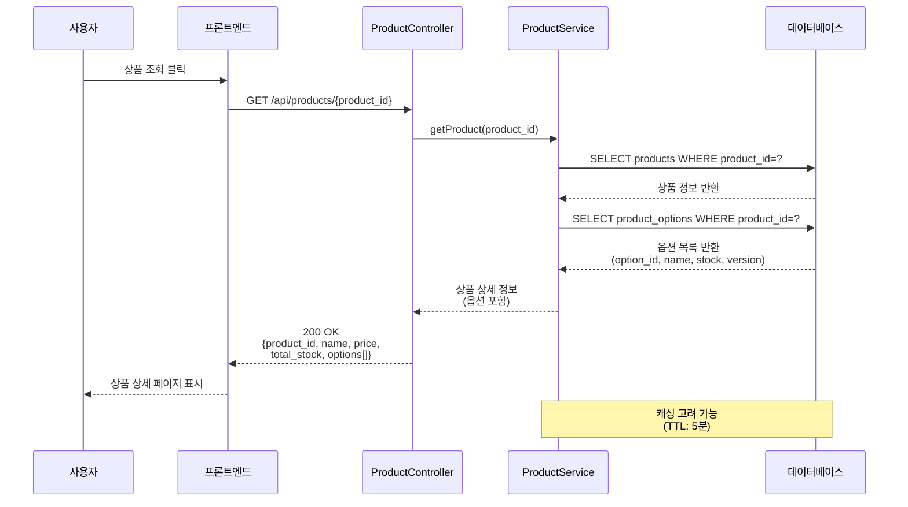
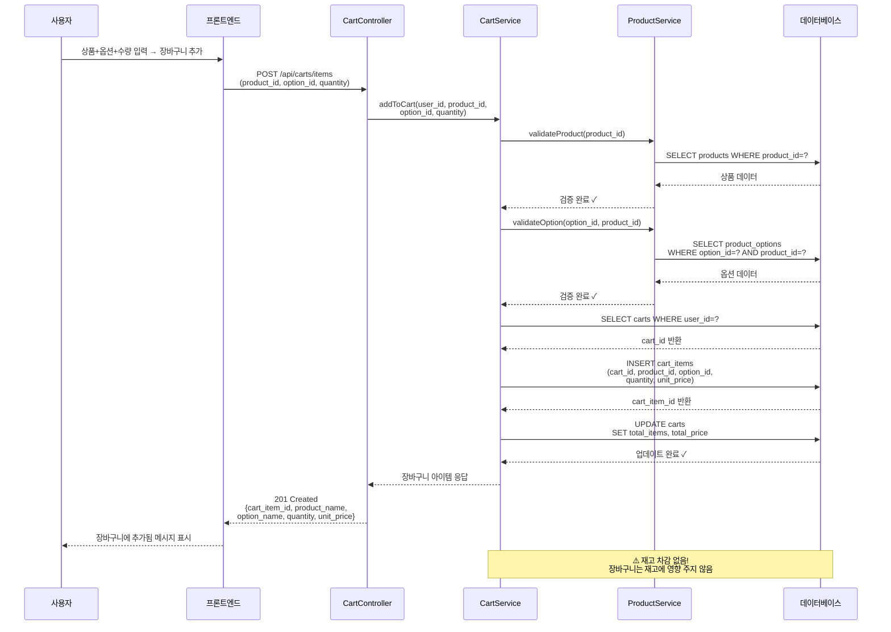
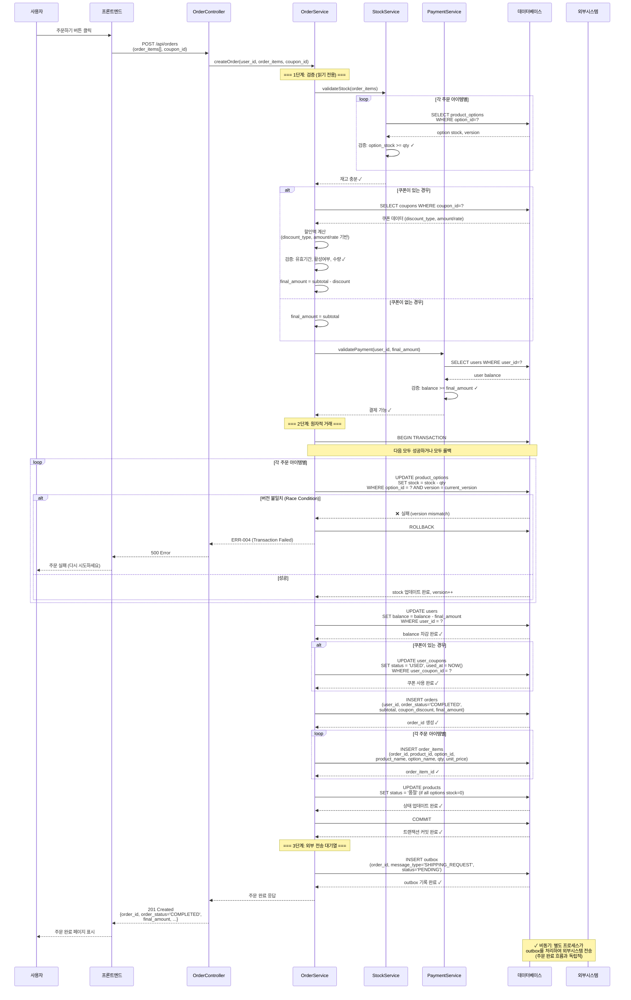
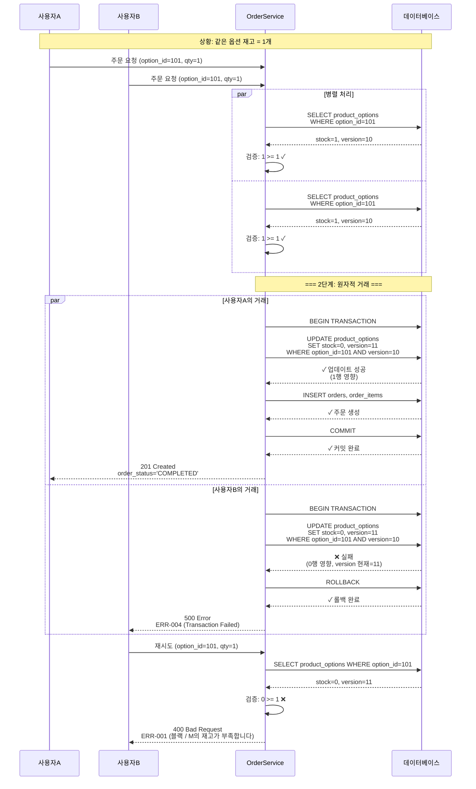
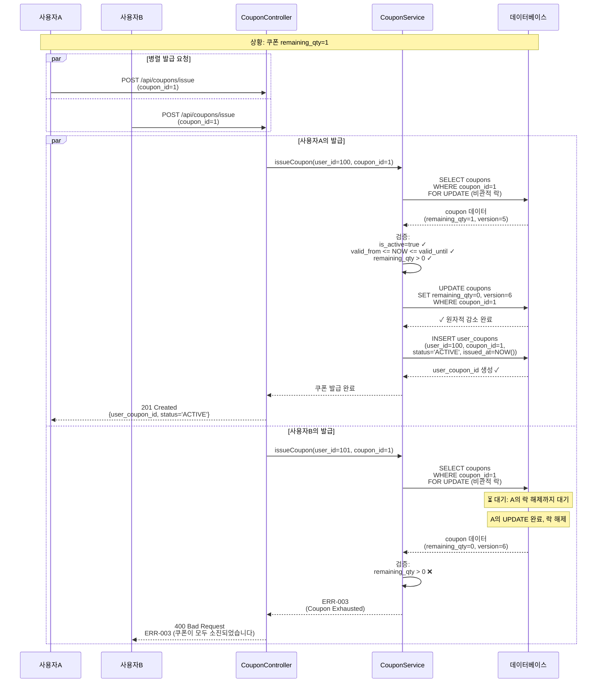
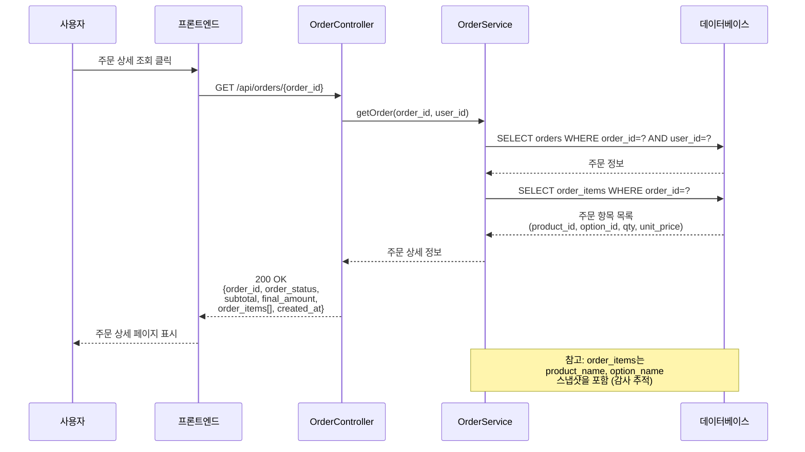
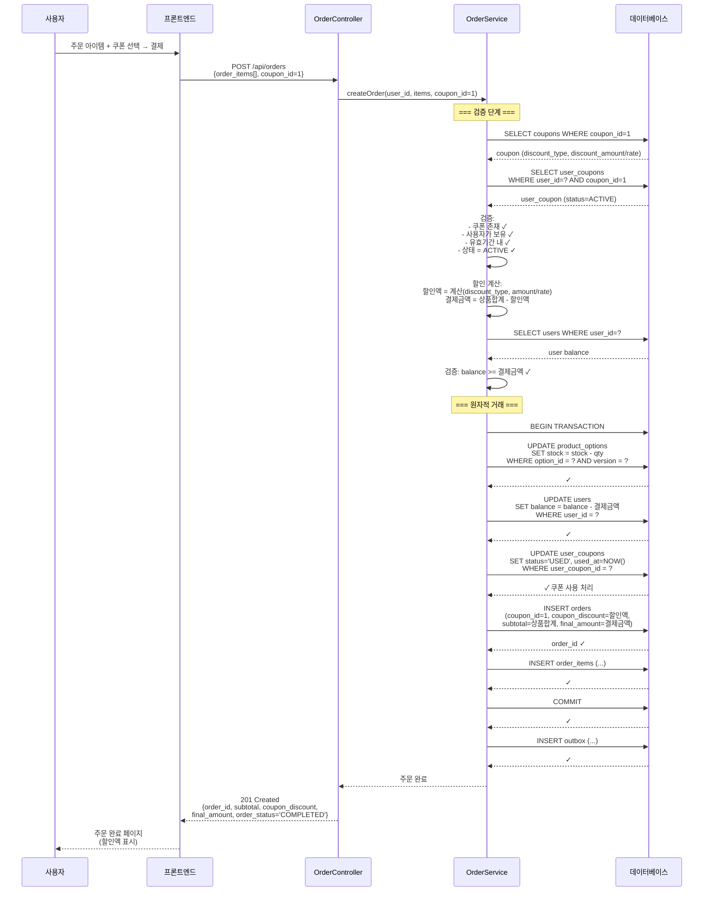
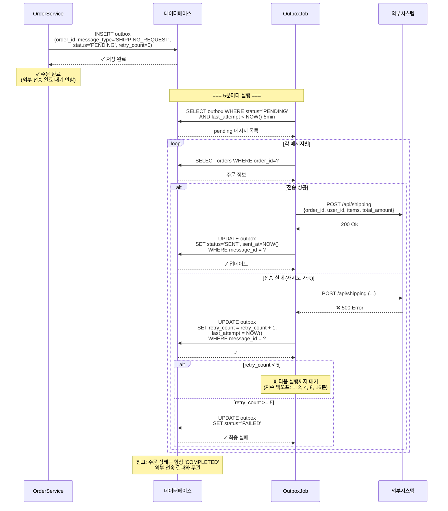
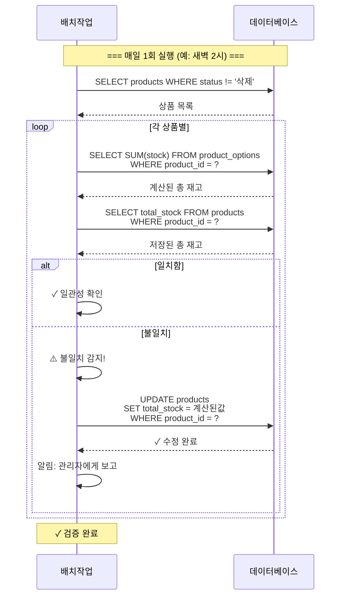
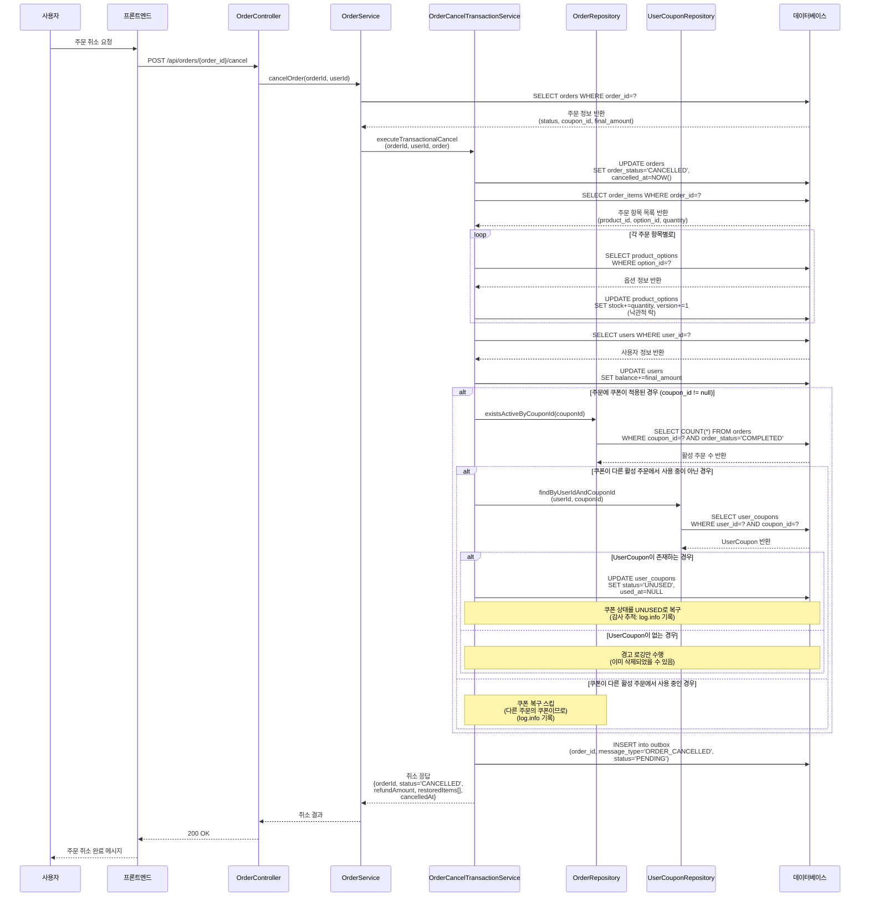

# E-Commerce 플랫폼 시퀀스 다이어그램

## 개요

이 문서는 e-commerce 플랫폼의 주요 비즈니스 흐름을 Mermaid 시퀀스 다이어그램으로 나타냅니다. 각 다이어그램은 참여자(사용자, 프론트엔드, API, 서비스, 데이터베이스, 외부 시스템) 간의 상호작용을 보여줍니다.

---

## 1. 상품 조회 흐름

**관련 엔티티**: users, products, product_options



**비즈니스 로직**:
- 상품 정보는 `products` 테이블에서 조회
- 옵션 정보는 `product_options` 테이블에서 조회
- **옵션별 재고**: 각 옵션의 `stock` 필드 확인
- **상품 총 재고**: 모든 옵션의 재고 합계

---

## 2. 장바구니 담기 흐름

**관련 엔티티**: users, carts, cart_items, products, product_options



**비즈니스 로직** (요구사항 2.2.1, 2.1.4):
- 상품과 옵션 검증 (필수)
- **재고 차감 없음**: 장바구니 단계에서는 재고를 차감하지 않음
- **옵션 필수**: cart_items의 option_id는 NOT NULL
- cart_id와 user_id는 1:1 관계

---

## 3. 주문 생성 흐름 (3단계)

**관련 엔티티**: users, products, product_options, orders, order_items, coupons, user_coupons, outbox



**비즈니스 로직** (요구사항 2.2.2, 2.2.3, 2.4):
- **1단계 (검증)**: 모든 읽기만 수행, 데이터 변경 없음
  - 각 옵션의 재고 확인 (옵션 ID 기준)
  - 사용자 잔액 확인
  - 쿠폰 유효성 확인
- **2단계 (원자적 거래)**: 모두 성공하거나 모두 롤백
  - 각 옵션의 재고 차감 (낙관적 락)
  - 사용자 잔액 차감
  - 주문 및 주문 항목 생성
  - 쿠폰 사용 처리
- **3단계 (외부 전송)**: 주문 완료 후 비동기 처리
  - 트랜잭션과 독립적
  - outbox에 메시지 저장
  - 별도 프로세스가 처리

---

## 4. 동시 주문 처리 (Race Condition 방지)

**관련 엔티티**: product_options (version 필드)



**동시성 제어** (요구사항 2.1.2, 3.2):
- **낙관적 락**: version 필드를 이용한 동시성 제어
- 두 사용자가 동시에 같은 상품 주문 가능
- 첫 번째 사용자: version 일치 → 성공, version 증가
- 두 번째 사용자: version 불일치 → 실패, 롤백

---

## 5. 쿠폰 발급 흐름 (선착순)

**관련 엔티티**: coupons, user_coupons



**쿠폰 발급 로직** (요구사항 2.3.1, 3.2):
- **비관적 락**: SELECT ... FOR UPDATE로 다른 요청 차단
- 재고 > 0 검증
- **원자적 감소**: remaining_qty를 한 번에 1 감소
- **UNIQUE 제약**: UNIQUE(user_id, coupon_id)로 중복 발급 방지
- 동시 요청 시 한 명만 성공, 나머지는 ERR-003

---

## 6. 주문 조회 흐름

**관련 엔티티**: users, orders, order_items, products, product_options



---

## 7. 쿠폰 적용 주문 흐름

**관련 엔티티**: users, products, product_options, orders, order_items, coupons, user_coupons



**쿠폰 적용 로직** (요구사항 2.2.4):
- **결제 금액 계산**: (상품 합계 - 쿠폰 할인액)
- **원자적 처리**: 쿠폰 사용 상태도 거래에 포함
- **쿠폰 상태 변경**: ACTIVE → USED
- 모든 작업이 성공하거나 모두 롤백

---

## 8. 외부 시스템 전송 (비동기)

**관련 엔티티**: outbox, orders



**외부 전송 로직** (요구사항 2.4):
- **비동기 처리**: 주문 완료와 독립적
- **Outbox 패턴**: 신뢰성 있는 전송 보장
- **재시도 전략**: 지수 백오프 (1, 2, 4, 8, 16분), 최대 5회
- **실패 처리**: 전송 실패해도 주문은 COMPLETED 상태 유지

---

## 9. 데이터 일관성 검증 (정기적)

**관련 엔티티**: products, product_options



**데이터 일관성** (요구사항 3.3, BR-04-2):
- **일관성 검증**: products.total_stock = SUM(product_options.stock)
- **정기적 검증**: 일일 배치 작업으로 검증
- **자동 수정**: 불일치 시 자동으로 재계산하여 수정
- **감사 로그**: 불일치 발견 시 관리자 알림

---

## 10. 에러 처리 및 응답 코드

### 에러 코드 정의

| 에러 코드 | HTTP 상태 | 메시지 | 상황 |
|----------|-----------|--------|------|
| ERR-001 | 400 | "[옵션명]의 재고가 부족합니다" | 옵션 재고 부족 |
| ERR-002 | 400 | "잔액이 부족합니다" | 사용자 잔액 부족 |
| ERR-003 | 400 | "유효하지 않은 쿠폰입니다" | 쿠폰 검증 실패 또는 소진 |
| ERR-004 | 500 | "주문 생성에 실패했습니다" | 거래 실패 (버전 불일치) |

### 요청/응답 예시

**성공 응답 (201 Created)**:
```json
{
  "order_id": 5001,
  "order_status": "COMPLETED",
  "subtotal": 59800,
  "coupon_discount": 0,
  "final_amount": 59800,
  "created_at": "2025-10-29T12:45:00Z"
}
```

**에러 응답 (400 Bad Request)**:
```json
{
  "error_code": "ERR-001",
  "error_message": "블랙 / M의 재고가 부족합니다",
  "timestamp": "2025-10-29T12:45:00Z"
}
```

---

## 참고사항

### 동시성 제어 전략

| 작업 | 제어 방식 | 필드 |
|------|---------|------|
| 주문 시 재고 차감 | 낙관적 락 | product_options.version |
| 쿠폰 발급 | 비관적 락 | SELECT ... FOR UPDATE |
| 사용자 잔액 차감 | 트랜잭션 격리 | 읽기-수정-쓰기 원자성 보장 |

### 트랜잭션 격리 수준

- **최소 수준**: READ_COMMITTED 이상
- **권장 수준**: REPEATABLE_READ 또는 SERIALIZABLE
- **목적**: 더티 리드, 비반복 읽기, 팬텀 읽기 방지

### 성능 고려사항

- **캐싱**: 상품 정보 조회 (TTL: 5분)
- **인덱싱**: product_id, user_id, option_id, coupon_id에 인덱스 필수
- **배치 처리**: 외부 전송, 데이터 검증 등 비동기 작업

---

## 11. 주문 취소 및 쿠폰 복구 흐름

**관련 엔티티**: orders, order_items, product_options, users, user_coupons, coupons

**설명**: 사용자가 주문을 취소할 때 모든 자원(주문 상태, 재고, 잔액, 쿠폰)을 원자적으로 복구하는 흐름입니다. 특히 쿠폰 복구는 다른 활성 주문에서 사용 중인지 확인 후 결정됩니다.



**비즈니스 로직** (변경: 2025-11-18):

**1단계: 주문 상태 변경**
- 주문 상태를 COMPLETED → CANCELLED로 변경
- cancelled_at 필드에 현재 시간 설정

**2단계: 재고 복구**
- 주문의 모든 항목(order_items)을 조회
- 각 상품 옵션의 재고를 원래 수량만큼 복구
- 낙관적 락(version 증가)으로 동시성 제어

**3단계: 사용자 잔액 복구**
- 최종 결제액(final_amount)을 사용자 잔액에 반환

**4단계: 쿠폰 복구** ⭐ **2025-11-18 신규**
- **(1) 쿠폰 사용 중 여부 확인**: `OrderRepository.existsActiveByCouponId(couponId)` 호출
  - 해당 쿠폰이 다른 **활성(COMPLETED) 주문**에서 사용 중인지 확인
  - SQL: `SELECT COUNT(*) FROM orders WHERE coupon_id=? AND order_status='COMPLETED'`

- **(2) UserCoupon 조회**: 쿠폰이 다른 주문에서 사용 중이 아닐 때만
  - `UserCouponRepository.findByUserIdAndCouponId(userId, couponId)` 호출
  - UserCoupon 엔티티 존재 여부 확인

- **(3) 상태 복구**: UserCoupon이 존재할 경우
  - `UserCoupon.status` = `UNUSED`로 변경
  - `used_at` 필드를 NULL로 초기화
  - SLF4J 로깅: `log.info()` (감사 추적)

**변경 사항 (2025-11-18)**:
- **이전**: 쿠폰 사용 여부를 `user_coupons.order_id` 칼럼으로 추적
- **현재**: 쿠폰 사용 여부를 `orders.coupon_id` 존재 여부로 추적
  - `user_coupons` 테이블은 "쿠폰 보유 상태"(UNUSED/USED/EXPIRED/CANCELLED)만 관리
  - 쿠폰 복구 판단: 다른 활성 주문에서 사용 중인지 확인 후 결정

**5단계: Outbox 메시지 생성**
- 주문 취소 이벤트를 outbox에 저장
- 비동기 배치가 외부 시스템에 전송

**에러 처리**:
- 낙관적 락 실패 → 버전 불일치 → 트랜잭션 롤백
- UserCoupon 미발견 → 경고 로깅 후 계속 진행 (쿠폰이 이미 삭제되었을 가능성)
- 모든 작업은 `@Transactional` 범위 내에서 원자적으로 처리

### 요청/응답 예시

**요청**:
```http
POST /api/orders/{order_id}/cancel
Authorization: Bearer {token}
Content-Type: application/json

{}
```

**성공 응답 (200 OK)**:
```json
{
  "order_id": 5001,
  "order_status": "CANCELLED",
  "refund_amount": 59800,
  "cancelled_at": "2025-11-18T14:30:00Z",
  "restored_items": [
    {
      "order_item_id": 1,
      "product_id": 101,
      "product_name": "나이키 에어맥스",
      "option_id": 201,
      "option_name": "Black/M",
      "quantity": 2,
      "restored_stock": 15
    }
  ]
}
```

**에러 응답 (400 Bad Request)**:
```json
{
  "error_code": "CANCEL-001",
  "error_message": "이미 취소된 주문입니다",
  "timestamp": "2025-11-18T14:30:00Z"
}
```
