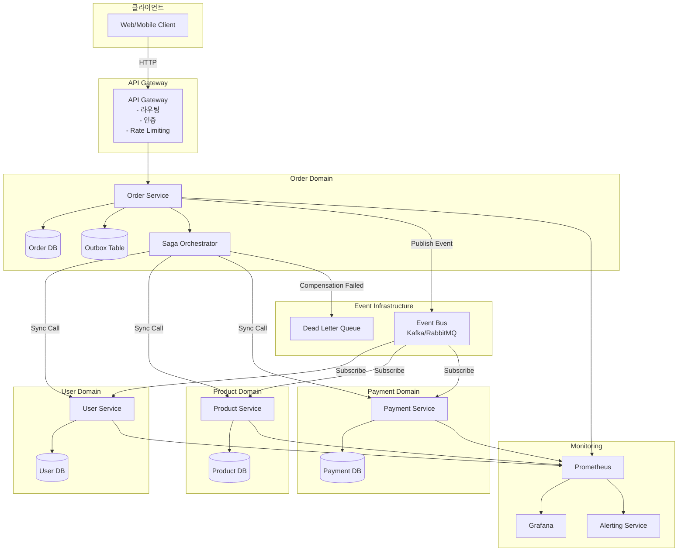
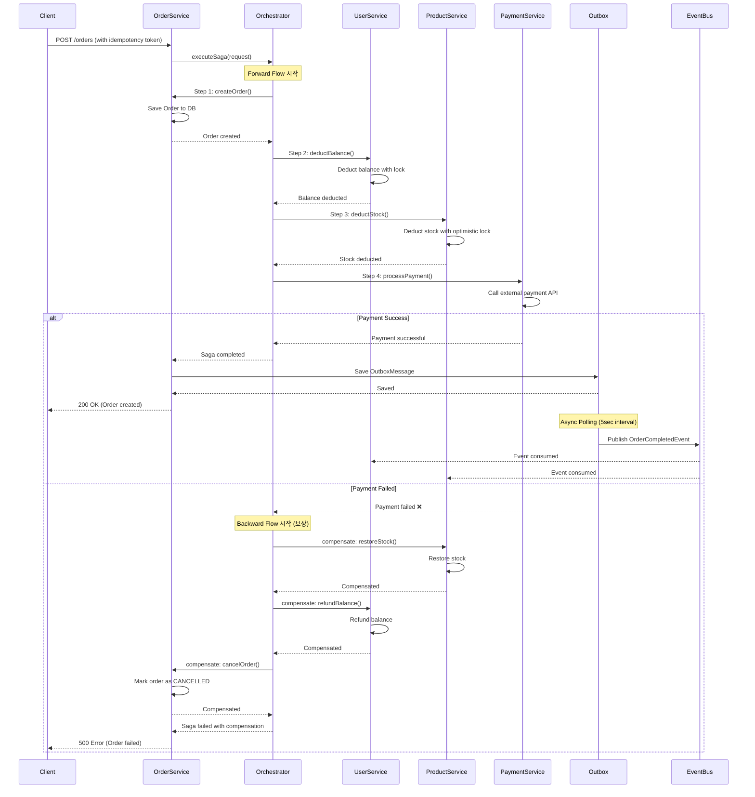
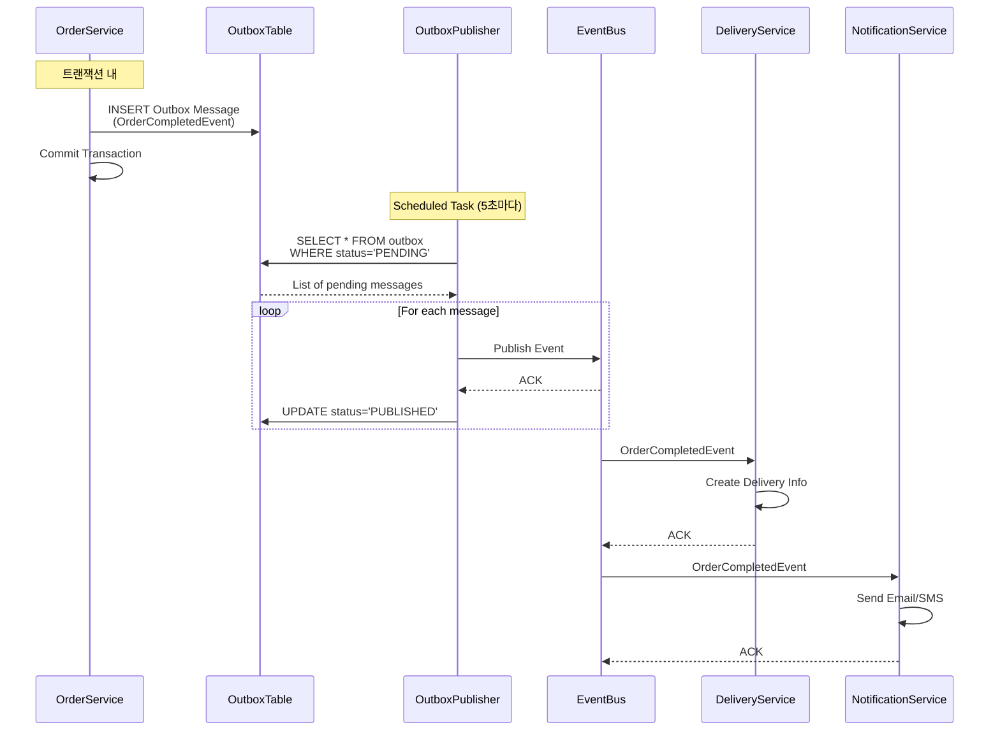

# 분산 트랜잭션 처리 설계 (MSA/도메인 분리 환경)

## 목차
- [1. 개요](#1-개요)
- [2. 문제 정의](#2-문제-정의)
- [3. 트랜잭션 처리 한계 분석](#3-트랜잭션-처리-한계-분석)
- [4. 대응 전략 및 패턴](#4-대응-전략-및-패턴)
- [5. 아키텍처 설계](#5-아키텍처-설계)
- [6. 장애 시나리오 및 복원 전략](#6-장애-시나리오-및-복원-전략)
- [7. 구현 가이드](#7-구현-가이드)
- [8. 모니터링 및 운영](#8-모니터링-및-운영)

---

## 1. 개요

### 1.1 배경
이커머스 서비스가 성장함에 따라 모놀리식 아키텍처의 한계에 도달했습니다. 다음과 같은 문제가 발생합니다:

- **확장성 한계**: 단일 애플리케이션 서버와 DB로는 트래픽 증가에 대응 불가
- **배포 리스크**: 전체 서비스를 한 번에 배포해야 하므로 장애 영향 범위가 큼
- **팀 확장 어려움**: 여러 팀이 하나의 코드베이스를 공유하여 개발 속도 저하
- **기술 스택 제약**: 모든 기능이 동일한 기술 스택을 사용해야 함

### 1.2 MSA 전환 목표

```
[기존: 모놀리식]                [전환 후: MSA]

┌─────────────────┐            ┌──────────┐  ┌──────────┐  ┌──────────┐
│                 │            │  User    │  │ Product  │  │  Order   │
│   Monolithic    │    →       │ Service  │  │ Service  │  │ Service  │
│   Application   │            └────┬─────┘  └────┬─────┘  └────┬─────┘
│                 │                 │             │             │
└────────┬────────┘            ┌────┴─────┐  ┌────┴─────┐  ┌────┴─────┐
         │                     │ User DB  │  │Product DB│  │ Order DB │
    ┌────┴─────┐               └──────────┘  └──────────┘  └──────────┘
    │ Shared   │
    │    DB    │
    └──────────┘
```

### 1.3 도메인 분리 구조

본 설계에서는 다음과 같이 도메인을 분리합니다:

| 도메인 | 책임 | DB |
|--------|------|-----|
| **User Service** | 사용자 정보, 인증, 잔액 관리 | user_db |
| **Product Service** | 상품 정보, 재고 관리 | product_db |
| **Order Service** | 주문 생성, 주문 상태 관리 | order_db |
| **Coupon Service** | 쿠폰 발급, 사용, 검증 | coupon_db |
| **Payment Service** | 결제 처리, 결제 이력 | payment_db |
| **Delivery Service** | 배송 정보 관리 | delivery_db |

---

## 2. 문제 정의

### 2.1 분산 트랜잭션 문제

MSA 환경에서는 **단일 DB 트랜잭션(ACID)으로 여러 서비스의 데이터 일관성을 보장할 수 없습니다**.

#### 전형적인 주문 시나리오
```
[주문 생성 흐름]

1. Order Service: 주문 생성
2. User Service: 사용자 잔액 차감
3. Product Service: 재고 차감
4. Coupon Service: 쿠폰 사용 처리
5. Payment Service: 결제 처리
6. Delivery Service: 배송 정보 생성
```

**문제점**:
- 각 서비스가 독립적인 DB를 가지므로, 하나의 트랜잭션으로 묶을 수 없음
- 3단계에서 재고 부족 시, 1~2단계를 어떻게 롤백할 것인가?
- 5단계에서 결제 실패 시, 1~4단계를 어떻게 되돌릴 것인가?
- 네트워크 장애로 일부 서비스만 성공한 경우 어떻게 처리할 것인가?

### 2.2 데이터 일관성 문제

#### 2.2.1 Eventual Consistency vs Strong Consistency

MSA에서는 **최종 일관성(Eventual Consistency)**을 추구합니다:

| 특성 | Strong Consistency | Eventual Consistency |
|------|-------------------|----------------------|
| **일관성** | 즉시 보장 | 시간차 후 보장 |
| **성능** | 낮음 (락 대기) | 높음 (비동기 처리) |
| **확장성** | 제한적 | 높음 |
| **복잡도** | 낮음 | 높음 (보상 로직 필요) |
| **적용 사례** | 금융 거래 | 주문, 재고 관리 |

#### 2.2.2 일관성 문제 예시

```
시나리오: 동시에 두 사용자가 마지막 재고 1개 상품을 주문

[User A]                    [User B]
1. 주문 생성 ✓              1. 주문 생성 ✓
2. 재고 차감 (1→0) ✓        2. 재고 차감 (0→-1) ❌
3. 잔액 차감 ✓              3. 잔액 차감 ✓
4. 결제 성공 ✓              4. 재고 부족 감지

→ User A는 성공, User B는 보상 트랜잭션 실행 필요
→ User B의 잔액을 다시 복구해야 함
```

### 2.3 네트워크 장애 및 타임아웃

```
[네트워크 파티션 시나리오]

Order Service → User Service (잔액 차감)
    ↓
  타임아웃 발생 (30초)
    ↓
Order Service는 실패로 간주
    ↓
하지만 User Service는 실제로 성공했을 수 있음
    ↓
→ 돈은 빠져나갔지만 주문은 생성되지 않음
```

**문제**:
- 네트워크 타임아웃만으로는 실제 성공 여부를 알 수 없음
- 멱등성(Idempotency) 보장 필요
- 재시도 로직이 중복 실행을 유발할 수 있음

### 2.4 부분 실패(Partial Failure)

```
[부분 실패 예시]

✓ 1. 주문 생성 성공
✓ 2. 잔액 차감 성공
✓ 3. 재고 차감 성공
❌ 4. 쿠폰 사용 실패 (Coupon Service 장애)
❌ 5. 결제 미실행
❌ 6. 배송 미실행

→ 1~3은 성공, 4~6은 실패
→ 어떻게 일관성을 유지할 것인가?
```

---

## 3. 트랜잭션 처리 한계 분석

### 3.1 2PC (Two-Phase Commit)의 한계

#### 3.1.1 2PC 프로토콜
```
[Phase 1: Prepare]
Coordinator → Participant A: Can you commit?
Coordinator → Participant B: Can you commit?

A → Coordinator: Yes
B → Coordinator: Yes

[Phase 2: Commit]
Coordinator → A: Commit
Coordinator → B: Commit
```

#### 3.1.2 2PC의 문제점

| 문제 | 설명 | 영향 |
|------|------|------|
| **Blocking** | Coordinator 장애 시 모든 참여자가 대기 | 가용성 저하 |
| **성능 저하** | 모든 참여자가 준비 완료까지 락 유지 | 동시성 감소 |
| **확장성 제약** | 참여자 수에 비례하여 성능 악화 | MSA에 부적합 |
| **단일 장애점** | Coordinator가 SPOF | 복원 복잡 |

**결론**: MSA 환경에서 2PC는 **비추천**

### 3.2 분산 트랜잭션의 CAP 이론

```
CAP 이론: 분산 시스템은 다음 3가지 중 2가지만 보장 가능

┌─────────────────────────────────────┐
│                                     │
│         C (Consistency)             │
│       일관성: 모든 노드가            │
│       동일한 데이터를 봄             │
│              ╱  ╲                   │
│             ╱    ╲                  │
│            ╱      ╲                 │
│           ╱        ╲                │
│          ╱          ╲               │
│         ╱            ╲              │
│   A (Availability)   P (Partition)  │
│   가용성: 모든        Tolerance     │
│   요청에 응답        파티션 허용     │
│                                     │
└─────────────────────────────────────┘

MSA 선택: AP (가용성 + 파티션 허용)
         → Eventual Consistency 추구
```

### 3.3 서비스별 트랜잭션 경계

#### 3.3.1 단일 서비스 내 트랜잭션 (가능)
```java
@Transactional
public Order createOrder(CreateOrderRequest request) {
    // ✅ 같은 DB 내에서는 ACID 보장
    Order order = orderRepository.save(new Order(...));
    orderItemRepository.saveAll(order.getItems());
    return order;
}
```

#### 3.3.2 다중 서비스 간 트랜잭션 (불가능)
```java
@Transactional  // ❌ 다른 서비스의 DB는 포함 안 됨
public Order createOrderWithPayment(CreateOrderRequest request) {
    // Order Service DB
    Order order = orderRepository.save(new Order(...));

    // User Service DB (별도 DB)
    userServiceClient.deductBalance(userId, amount);  // 다른 트랜잭션

    // Product Service DB (별도 DB)
    productServiceClient.deductStock(productId, quantity);  // 다른 트랜잭션

    // ❌ 하나라도 실패하면 나머지는 어떻게 롤백?
}
```

### 3.4 트랜잭션 처리 한계 요약

| 한계 | 설명 | 대응 방안 |
|------|------|----------|
| **ACID 보장 불가** | 여러 DB에 걸친 원자성 보장 불가 | Saga 패턴 |
| **롤백 불가** | 다른 서비스의 커밋된 데이터 롤백 불가 | 보상 트랜잭션 |
| **일관성 지연** | 즉시 일관성 보장 불가 | Eventual Consistency |
| **네트워크 장애** | 타임아웃, 파티션 | 멱등성 + 재시도 |
| **부분 실패** | 일부만 성공 | Saga Orchestrator |
| **순서 보장 어려움** | 이벤트 순서 뒤바뀜 가능 | Event Ordering |

---

## 4. 대응 전략 및 패턴

### 4.1 이벤트 기반 아키텍처

#### 4.1.1 동기 vs 비동기

```
[동기 방식 (REST API)]
Order Service → (HTTP) → User Service → (HTTP) → Product Service
    ↓ 대기            ↓ 대기              ↓ 대기
  응답 대기          응답 대기          DB 처리

문제: 직렬 처리, 한 서비스 장애 시 전체 실패, 타임아웃 누적

[비동기 방식 (Event)]
Order Service → Event Bus
                   ↓
    ┌──────────────┼──────────────┐
    ↓              ↓               ↓
User Service  Product Service  Coupon Service
(구독)         (구독)            (구독)

장점: 병렬 처리, 장애 격리, 확장 용이
```

#### 4.1.2 Spring Application Event 활용

```java
// 이벤트 정의
public class OrderCreatedEvent {
    private Long orderId;
    private Long userId;
    private List<OrderItem> items;
    private Long totalAmount;
}

// 이벤트 발행
@Service
public class OrderService {
    private final ApplicationEventPublisher eventPublisher;

    @Transactional
    public Order createOrder(CreateOrderRequest request) {
        Order order = orderRepository.save(new Order(...));

        // 이벤트 발행 (트랜잭션 커밋 후)
        eventPublisher.publishEvent(new OrderCreatedEvent(order));

        return order;
    }
}

// 이벤트 리스너
@Component
public class OrderEventListener {

    @Async
    @TransactionalEventListener(phase = TransactionPhase.AFTER_COMMIT)
    public void handleOrderCreated(OrderCreatedEvent event) {
        // 비동기로 처리
        userService.deductBalance(event.getUserId(), event.getTotalAmount());
        productService.deductStock(event.getItems());
    }
}
```

**장점**:
- 서비스 간 결합도 감소
- 비동기 처리로 성능 향상
- 장애 격리 (한 서비스 실패가 다른 서비스에 영향 없음)

**단점**:
- 즉시 일관성 보장 어려움
- 디버깅 복잡도 증가
- 이벤트 순서 보장 필요

### 4.2 Saga 패턴

#### 4.2.1 Saga 패턴 개요

Saga는 **일련의 로컬 트랜잭션**으로 분산 트랜잭션을 구현하는 패턴입니다.

```
Saga = Local TX 1 → Local TX 2 → Local TX 3 → ... → Local TX N

실패 시:
Saga = Local TX 1 → Local TX 2 → ❌ Local TX 3
       ↓            ↓
   Compensate 1  Compensate 2  (보상 트랜잭션)
```

#### 4.2.2 Choreography vs Orchestration

**Choreography (이벤트 기반)**:
```
Order Service: 주문 생성 → OrderCreatedEvent 발행
    ↓
User Service: 이벤트 구독 → 잔액 차감 → BalanceDeductedEvent 발행
    ↓
Product Service: 이벤트 구독 → 재고 차감 → StockDeductedEvent 발행
    ↓
Payment Service: 이벤트 구독 → 결제 처리

장점: 결합도 낮음, 확장 용이
단점: 흐름 파악 어려움, 순환 의존 가능성
```

**Orchestration (중앙 제어)**:
```
Order Saga Orchestrator (중앙 제어자)
    ↓
1. Order Service: createOrder()
2. User Service: deductBalance()
3. Product Service: deductStock()
4. Payment Service: processPayment()

실패 시 Orchestrator가 보상 트랜잭션 관리

장점: 흐름 명확, 관리 용이
단점: Orchestrator가 SPOF, 결합도 증가
```

**본 프로젝트 선택**: **Orchestration** (명확한 흐름 관리 필요)

#### 4.2.3 Saga 구현 예시

```java
@Component
public class OrderSagaOrchestrator {

    private final List<SagaStep> steps;

    public Order executeSaga(CreateOrderRequest request) {
        SagaContext context = new SagaContext();
        List<SagaStep> executedSteps = new ArrayList<>();

        try {
            // Forward Flow
            for (SagaStep step : steps) {
                step.execute(context);
                executedSteps.add(step);
            }
            return context.getOrder();

        } catch (Exception e) {
            // Backward Flow (보상)
            Collections.reverse(executedSteps);
            for (SagaStep step : executedSteps) {
                try {
                    step.compensate(context);
                } catch (Exception compensationError) {
                    log.error("보상 실패: {}", step.getName(), compensationError);
                    // DLQ로 발행
                }
            }
            throw e;
        }
    }
}

// Saga Step 인터페이스
public interface SagaStep {
    void execute(SagaContext context) throws Exception;
    void compensate(SagaContext context) throws Exception;
    String getName();
    int getOrder();
}

// 예시: 재고 차감 Step
@Component
public class DeductInventoryStep implements SagaStep {

    @Override
    public void execute(SagaContext context) {
        productService.deductStock(context.getOrderItems());
        context.setInventoryDeducted(true);
    }

    @Override
    public void compensate(SagaContext context) {
        if (context.isInventoryDeducted()) {
            productService.restoreStock(context.getOrderItems());
        }
    }
}
```

### 4.3 Outbox 패턴

#### 4.3.1 Outbox 패턴 개요

**문제**: 트랜잭션 커밋과 이벤트 발행의 원자성 보장

```
[문제 상황]
@Transactional
public void createOrder() {
    orderRepository.save(order);  // DB 커밋
    eventPublisher.publish(event); // 이벤트 발행

    → 만약 이벤트 발행 실패하면?
    → DB는 커밋됨, 이벤트는 발행 안 됨 (불일치)
}
```

**해결**: Outbox 테이블 사용

```
[Outbox 패턴]
@Transactional
public void createOrder() {
    orderRepository.save(order);
    outboxRepository.save(new OutboxMessage(event));  // 같은 트랜잭션
}

→ 별도 배치/폴링: Outbox 테이블 조회 → 이벤트 발행 → 상태 업데이트
```

#### 4.3.2 Outbox 테이블 설계

```sql
CREATE TABLE outbox (
    message_id BIGINT PRIMARY KEY AUTO_INCREMENT,
    aggregate_type VARCHAR(50) NOT NULL,  -- Order, User, Product
    aggregate_id BIGINT NOT NULL,         -- orderId, userId
    event_type VARCHAR(100) NOT NULL,     -- OrderCreatedEvent
    payload JSON NOT NULL,                -- 이벤트 데이터
    status VARCHAR(20) NOT NULL,          -- PENDING, PUBLISHED, FAILED
    retry_count INT DEFAULT 0,
    created_at TIMESTAMP DEFAULT CURRENT_TIMESTAMP,
    published_at TIMESTAMP,

    INDEX idx_status_created (status, created_at)
);
```

#### 4.3.3 Outbox Publisher 구현

```java
@Component
public class OutboxEventPublisher {

    private final OutboxRepository outboxRepository;
    private final ApplicationEventPublisher eventPublisher;

    // 1. Outbox 메시지 저장 (트랜잭션 내)
    @Transactional
    public void saveOutboxMessage(String eventType, Object payload, Long aggregateId) {
        Outbox outbox = Outbox.builder()
            .eventType(eventType)
            .payload(toJson(payload))
            .aggregateId(aggregateId)
            .status(OutboxStatus.PENDING)
            .build();

        outboxRepository.save(outbox);
    }

    // 2. 배치로 Outbox 메시지 발행 (스케줄러)
    @Scheduled(fixedDelay = 5000)  // 5초마다
    public void publishPendingMessages() {
        List<Outbox> pending = outboxRepository
            .findByStatusOrderByCreatedAtAsc(OutboxStatus.PENDING, PageRequest.of(0, 100));

        for (Outbox outbox : pending) {
            try {
                // 이벤트 발행
                Object event = fromJson(outbox.getPayload(), outbox.getEventType());
                eventPublisher.publishEvent(event);

                // 상태 업데이트
                outbox.markAsPublished();
                outboxRepository.save(outbox);

            } catch (Exception e) {
                // 재시도 카운트 증가
                outbox.incrementRetryCount();

                if (outbox.getRetryCount() >= 3) {
                    outbox.markAsFailed();
                    // DLQ로 이동 또는 알림
                }

                outboxRepository.save(outbox);
            }
        }
    }
}
```

### 4.4 보상 트랜잭션 (Compensating Transaction)

#### 4.4.1 보상 트랜잭션 설계 원칙

| 원칙 | 설명 | 예시 |
|------|------|------|
| **멱등성** | 여러 번 실행해도 결과 동일 | 잔액 복구: +1000원 (절대값) |
| **역순 실행** | LIFO 순서로 보상 | 4→3→2→1 순서 |
| **Best Effort** | 보상 실패 시에도 계속 진행 | 로그 + DLQ 발행 |
| **Critical Step** | 중요한 Step은 재시도 | 재고 복구 5회 재시도 |

#### 4.4.2 보상 트랜잭션 예시

```java
// Forward Transaction
public void execute(SagaContext context) {
    userService.deductBalance(userId, amount);
    context.setBalanceDeducted(true);
    context.setDeductedAmount(amount);
}

// Compensating Transaction
public void compensate(SagaContext context) {
    if (context.isBalanceDeducted()) {
        // 멱등성 보장: 금액을 기록해두었다가 정확히 복구
        userService.refundBalance(userId, context.getDeductedAmount());

        // 보상 성공 로깅
        log.info("잔액 복구 성공: userId={}, amount={}",
            userId, context.getDeductedAmount());
    }
}
```

#### 4.4.3 보상 실패 처리 (DLQ)

```java
private void compensate(SagaContext context) {
    List<SagaStep> executedSteps = context.getExecutedSteps();
    Collections.reverse(executedSteps);  // LIFO

    for (SagaStep step : executedSteps) {
        try {
            step.compensate(context);

        } catch (CriticalException e) {
            // Critical Step 실패: 즉시 알림 + DLQ
            alertService.notifyCriticalCompensationFailure(orderId, step.getName());
            compensationDLQ.publish(FailedCompensation.from(step, context, e));
            throw new CompensationException("Critical compensation failed", e);

        } catch (Exception e) {
            // 일반 Step 실패: 로그 + DLQ + 계속 진행
            log.error("보상 실패 (계속 진행): {}", step.getName(), e);
            compensationDLQ.publish(FailedCompensation.from(step, context, e));
        }
    }
}
```

### 4.5 멱등성 보장

#### 4.5.1 Idempotency Token 패턴

```java
// 클라이언트에서 UUID 생성하여 전송
POST /api/orders
{
    "idempotencyToken": "a1b2c3d4-e5f6-7890-abcd-ef1234567890",
    "userId": 1,
    "items": [...]
}

// 서버에서 처리
@Transactional
public Order createOrder(CreateOrderRequest request) {
    String token = request.getIdempotencyToken();

    // 1. 토큰으로 기존 실행 확인 (비관적 락)
    Optional<ExecutedTransaction> existing =
        executedTxRepository.findByIdempotencyTokenForUpdate(token);

    if (existing.isPresent()) {
        if (existing.get().getStatus() == COMPLETED) {
            // 이미 처리 완료 → 결과 반환 (중복 방지)
            return orderRepository.findById(existing.get().getOrderId()).orElse(null);
        }
    }

    // 2. 신규 처리
    ExecutedTransaction tx = ExecutedTransaction.create(token, PENDING);
    executedTxRepository.save(tx);

    // 3. 비즈니스 로직 실행
    Order order = processOrder(request);

    // 4. 완료 표시
    tx.markAsCompleted(order.getOrderId());
    executedTxRepository.save(tx);

    return order;
}
```

---

## 5. 아키텍처 설계

### 5.1 전체 아키텍처 다이어그램



### 5.2 주문 처리 흐름 (Saga Orchestration)



### 5.3 이벤트 기반 비동기 처리 흐름



### 5.4 트랜잭션 경계 설계

```
┌─────────────────────────────────────────────────────────────┐
│                      Order Service                          │
│                                                             │
│  ┌───────────────────────────────────────────────────────┐  │
│  │  Saga Orchestrator (중앙 제어)                        │  │
│  │  - 트랜잭션 경계 없음 (각 Step이 독립 트랜잭션)        │  │
│  └───────────────────────────────────────────────────────┘  │
│                                                             │
│  Step 1: Create Order                                       │
│  ┌─────────────────────────────┐                            │
│  │ @Transactional              │                            │
│  │ - orderRepository.save()    │                            │
│  │ - outboxRepository.save()   │  ← 같은 트랜잭션           │
│  └─────────────────────────────┘                            │
│                                                             │
└─────────────────────────────────────────────────────────────┘

┌─────────────────────────────────────────────────────────────┐
│                      User Service                           │
│                                                             │
│  Step 2: Deduct Balance                                     │
│  ┌──────────────────────────────────────┐                   │
│  │ @Transactional(REQUIRES_NEW)         │  ← 독립 트랜잭션 │
│  │ - SELECT FOR UPDATE (비관적 락)      │                   │
│  │ - userRepository.save()              │                   │
│  │ - executedTxRepository.save()        │  ← 멱등성 기록   │
│  └──────────────────────────────────────┘                   │
│                                                             │
└─────────────────────────────────────────────────────────────┘

┌─────────────────────────────────────────────────────────────┐
│                    Product Service                          │
│                                                             │
│  Step 3: Deduct Stock                                       │
│  ┌──────────────────────────────────────┐                   │
│  │ @Transactional(REQUIRES_NEW)         │  ← 독립 트랜잭션 │
│  │ - @Version (낙관적 락)                │                   │
│  │ - productRepository.save()           │                   │
│  └──────────────────────────────────────┘                   │
│                                                             │
└─────────────────────────────────────────────────────────────┘
```

**핵심 원칙**:
1. **각 서비스의 Step은 독립 트랜잭션** (`REQUIRES_NEW`)
2. **Orchestrator는 트랜잭션 없음** (각 Step 호출만 담당)
3. **Outbox는 비즈니스 로직과 같은 트랜잭션** (원자성 보장)
4. **멱등성 기록은 비즈니스 로직과 같은 트랜잭션** (중복 방지)

---

## 6. 장애 시나리오 및 복원 전략

### 6.1 장애 유형별 대응

| 장애 유형 | 시나리오 | 대응 전략 | 복원 방법 |
|-----------|----------|-----------|-----------|
| **네트워크 타임아웃** | User Service 호출 30초 초과 | Circuit Breaker OPEN | 재시도 큐 + DLQ |
| **서비스 장애** | Product Service 다운 | 장애 격리, Fallback | Health Check + 재시도 |
| **부분 실패** | 3단계까지 성공, 4단계 실패 | 보상 트랜잭션 (LIFO) | Saga Orchestrator |
| **보상 실패** | 재고 복구 실패 | DLQ 발행 + 알림 | 수동 개입 + 재처리 |
| **중복 요청** | 네트워크 재시도로 동일 요청 2회 | Idempotency Token | 첫 번째만 처리 |
| **이벤트 발행 실패** | Outbox 메시지 발행 안 됨 | Outbox 패턴 | 배치 재발행 |
| **DB 장애** | Order DB 다운 | Read Replica + Cache | Failover |
| **메시지 유실** | Event Bus 장애 | At-least-once delivery | Outbox 재발행 |

### 6.2 시나리오 1: 결제 서비스 장애

```
[장애 발생]
1. Order 생성 ✓
2. 잔액 차감 ✓
3. 재고 차감 ✓
4. 결제 처리 → Payment Service 다운 ❌

[Circuit Breaker 동작]
→ 50% 이상 실패 감지
→ Circuit OPEN
→ Fallback 메서드 실행

[Fallback 처리]
1. 부분 성공 state 기록
2. alertService.notifyNetworkPartition() 알림
3. 보상 트랜잭션 실행:
   - 재고 복구 (Critical: 5회 재시도)
   - 잔액 복구 (Critical: 5회 재시도)
   - 주문 취소
4. DLQ에 FailedOrder 발행

[복원]
→ Payment Service 복구 후
→ Circuit HALF_OPEN → CLOSED
→ DLQ 메시지 수동 재처리
```

### 6.3 시나리오 2: 보상 트랜잭션 실패

```
[상황]
Order 생성 실패 → 보상 트랜잭션 시작
  ↓
1. 주문 취소 ✓
2. 쿠폰 복구 ✓
3. 재고 복구 → DB Lock Timeout ❌
4. 잔액 복구 (실행 안 됨)

[문제]
→ 재고는 복구 안 됨 (재고 -1 상태 유지)
→ 잔액은 복구 안 됨 (잔액 그대로)
→ 데이터 불일치 발생

[대응]
1. Critical Step 재시도 (재고 복구)
   - 1차 시도 실패
   - 100ms 대기 (Exponential Backoff)
   - 2차 시도 실패
   - 200ms 대기
   - 3차 시도 실패
   - 400ms 대기
   - 4차 시도 실패
   - 800ms 대기
   - 5차 시도 실패

2. 재시도 초과 → DLQ 발행
   FailedCompensation {
       orderId: 123,
       stepName: "DeductInventoryStep",
       errorMessage: "Lock timeout",
       retryCount: 5,
       status: PENDING
   }

3. alertService.notifyCriticalCompensationFailure() 즉시 알림
   - Slack: #critical-alerts
   - PagerDuty: CRITICAL
   - Email: admin@company.com

[수동 복원]
1. DLQ 조회
2. DB 직접 확인 (재고 상태)
3. 수동으로 재고 +1
4. DLQ 메시지 RESOLVED 처리
5. 고객에게 보상 (포인트 지급 등)
```

### 6.4 시나리오 3: 중복 요청 (Idempotency)

```
[상황]
클라이언트 → API Gateway → Order Service
                              ↓ (타임아웃 30초)
                           (응답 없음)
클라이언트 → 재시도 → API Gateway → Order Service
                                      ↓
                                   (첫 번째 요청은 이미 처리 중)

[문제]
→ 동일한 주문이 2번 생성될 수 있음

[대응: Idempotency Token]
@Transactional
public Order createOrder(CreateOrderRequest request) {
    String token = request.getIdempotencyToken();

    // 비관적 락으로 동시 요청 차단
    Optional<ExecutedTransaction> existing =
        executedTxRepository.findByIdempotencyTokenForUpdate(token);

    if (existing.isPresent()) {
        ExecutedTransaction tx = existing.get();

        if (tx.getStatus() == COMPLETED) {
            // 첫 번째 요청이 이미 완료 → 결과 반환
            return orderRepository.findById(tx.getOrderId()).get();
        }

        if (tx.getStatus() == PENDING) {
            // 첫 번째 요청이 처리 중 → 두 번째는 대기
            // SELECT FOR UPDATE로 락 획득 대기
            // 첫 번째 완료 후 COMPLETED 확인하고 결과 반환
        }
    }

    // 신규 요청 처리
    ExecutedTransaction tx = ExecutedTransaction.create(token, PENDING);
    executedTxRepository.save(tx);

    Order order = processOrder(request);

    tx.markAsCompleted(order.getOrderId());
    executedTxRepository.save(tx);

    return order;
}

[결과]
→ 첫 번째 요청: 정상 처리
→ 두 번째 요청: 첫 번째 결과 반환 (중복 방지)
```

### 6.5 시나리오 4: Outbox 메시지 유실 방지

```
[상황]
@Transactional
public void createOrder() {
    orderRepository.save(order);  // DB 커밋

    // 여기서 서버 장애 발생 ❌

    eventPublisher.publish(OrderCreatedEvent);  // 실행 안 됨
}

→ Order는 저장됨, Event는 발행 안 됨
→ 배송 정보 생성 안 됨
→ 고객 알림 발송 안 됨

[대응: Outbox 패턴]
@Transactional
public void createOrder() {
    orderRepository.save(order);
    outboxRepository.save(new OutboxMessage(event));  // 같은 트랜잭션

    // 둘 다 커밋되거나 둘 다 롤백
}

→ 배치 프로세스가 5초마다 Outbox 테이블 조회
→ PENDING 메시지 발행
→ 성공 시 PUBLISHED로 업데이트

[재시도 전략]
1차 시도 실패 → retryCount = 1, 계속 시도
2차 시도 실패 → retryCount = 2, 계속 시도
3차 시도 실패 → retryCount = 3, FAILED로 표시

→ FAILED 메시지는 DLQ로 이동
→ 수동 재처리 또는 자동 재시도 (1시간 후)
```

### 6.6 복원 전략 요약

```
[자동 복원]
1. Circuit Breaker: 장애 감지 → OPEN → Fallback
2. Retry with Exponential Backoff: 일시적 장애 자동 복구
3. Outbox Pattern: 이벤트 유실 방지
4. Health Check: 서비스 상태 모니터링 → Auto Scaling

[반자동 복원]
1. DLQ 처리: 관리자가 DLQ 확인 → 재처리 버튼 클릭
2. Outbox 재발행: FAILED 메시지 → 수동 재발행

[수동 복원]
1. Critical 보상 실패: DB 직접 수정 + 고객 보상
2. 데이터 불일치: 정합성 검증 스크립트 → 수동 보정
3. 긴급 패치: 버그 수정 → 핫픽스 배포
```

---

## 7. 구현 가이드

### 7.1 프로젝트 구조

```
e-commerce/
├── order-service/
│   ├── application/
│   │   ├── OrderService.java
│   │   ├── saga/
│   │   │   ├── OrderSagaOrchestrator.java
│   │   │   ├── SagaStep.java
│   │   │   ├── SagaContext.java
│   │   │   ├── DeductInventoryStep.java
│   │   │   ├── DeductBalanceStep.java
│   │   │   ├── CompensationDLQ.java
│   │   │   └── FailedCompensation.java
│   │   └── outbox/
│   │       ├── OutboxEventPublisher.java
│   │       └── OutboxMessage.java
│   ├── domain/
│   │   ├── Order.java
│   │   ├── OrderRepository.java
│   │   ├── Outbox.java
│   │   └── OutboxRepository.java
│   └── infrastructure/
│       ├── persistence/
│       └── messaging/
│           ├── KafkaEventPublisher.java
│           └── KafkaEventConsumer.java
├── user-service/
├── product-service/
├── payment-service/
└── common/
    ├── exception/
    │   ├── SagaTimeoutException.java
    │   ├── CompensationException.java
    │   └── CriticalException.java
    └── events/
        ├── OrderCreatedEvent.java
        ├── OrderCompletedEvent.java
        └── OrderCancelledEvent.java
```

### 7.2 핵심 코드 예시

#### 7.2.1 Saga Orchestrator (완전한 버전)

```java
@Component
public class OrderSagaOrchestrator {

    private static final long SAGA_TIMEOUT_MILLIS = 30_000L;
    private static final int MAX_CRITICAL_RETRY = 5;

    private final List<SagaStep> steps;
    private final AlertService alertService;
    private final CompensationDLQ compensationDLQ;
    private final ExecutorService executorService;

    @CircuitBreaker(name = "orderSaga", fallbackMethod = "handleNetworkPartition")
    public Order executeSaga(Long userId,
                            List<OrderItemDto> orderItems,
                            Long couponId,
                            Long couponDiscount,
                            Long subtotal,
                            Long finalAmount) {

        SagaContext context = new SagaContext(userId, orderItems, couponId,
                                             couponDiscount, subtotal, finalAmount);

        // Timeout 관리
        Future<Order> future = executorService.submit(() ->
            executeSagaWithTimeout(context));

        try {
            return future.get(SAGA_TIMEOUT_MILLIS, TimeUnit.MILLISECONDS);

        } catch (TimeoutException e) {
            future.cancel(true);
            compensate(context);
            throw new SagaTimeoutException("Saga timeout", SAGA_TIMEOUT_MILLIS,
                context.getExecutedStepCount(), steps.size());

        } catch (ExecutionException e) {
            compensate(context);
            throw new RuntimeException("Saga failed", e.getCause());
        }
    }

    private Order executeSagaWithTimeout(SagaContext context) throws Exception {
        long startTime = System.currentTimeMillis();

        for (SagaStep step : steps) {
            // Timeout 체크
            if (System.currentTimeMillis() - startTime > SAGA_TIMEOUT_MILLIS) {
                throw new SagaTimeoutException("Timeout before step execution");
            }

            step.execute(context);
            context.addExecutedStep(step);
        }

        return context.getOrder();
    }

    private void compensate(SagaContext context) {
        List<SagaStep> executedSteps = new ArrayList<>(context.getExecutedSteps());
        Collections.reverse(executedSteps);  // LIFO

        // Critical Steps 우선 처리
        List<SagaStep> criticalSteps = identifyCriticalSteps(executedSteps);
        List<SagaStep> nonCriticalSteps = identifyNonCriticalSteps(executedSteps);

        // Critical Steps: 최대 5회 재시도
        for (SagaStep step : criticalSteps) {
            try {
                compensateWithRetry(step, context, MAX_CRITICAL_RETRY);
            } catch (Exception e) {
                alertService.notifyCriticalCompensationFailure(
                    context.getOrder().getOrderId(), step.getName());
                compensationDLQ.publish(FailedCompensation.from(
                    context.getOrder().getOrderId(), context.getUserId(),
                    step, e, context));
            }
        }

        // Non-Critical Steps: Best Effort
        for (SagaStep step : nonCriticalSteps) {
            try {
                step.compensate(context);
            } catch (Exception e) {
                log.error("Compensation failed: {}", step.getName(), e);
                compensationDLQ.publish(FailedCompensation.from(
                    context.getOrder().getOrderId(), context.getUserId(),
                    step, e, context));
            }
        }
    }

    private void compensateWithRetry(SagaStep step, SagaContext context,
                                     int maxRetry) throws Exception {
        int attempt = 0;
        Exception lastException = null;

        while (attempt < maxRetry) {
            try {
                attempt++;
                step.compensate(context);
                return;
            } catch (Exception e) {
                lastException = e;
                if (attempt < maxRetry) {
                    long backoff = (long) (100 * Math.pow(2, attempt - 1));
                    Thread.sleep(backoff);
                }
            }
        }

        throw new CriticalException("Compensation retry exceeded", lastException);
    }

    private Order handleNetworkPartition(Long userId, List<OrderItemDto> orderItems,
                                        Long couponId, Long couponDiscount,
                                        Long subtotal, Long finalAmount,
                                        Throwable exception) {
        log.error("Circuit Breaker OPEN: {}", exception.getMessage());

        String partialState = String.format(
            "Circuit Breaker OPEN: userId=%d, finalAmount=%d", userId, finalAmount);

        alertService.notifyNetworkPartition(userId, null, partialState);

        throw new RuntimeException("Network partition detected", exception);
    }
}
```

#### 7.2.2 Outbox Event Publisher

```java
@Component
public class OutboxEventPublisher {

    private final OutboxRepository outboxRepository;
    private final ApplicationEventPublisher eventPublisher;

    @Transactional
    public void saveOutboxMessage(String eventType, Object payload, Long aggregateId) {
        Outbox outbox = Outbox.builder()
            .eventType(eventType)
            .payload(toJson(payload))
            .aggregateId(aggregateId)
            .status(OutboxStatus.PENDING)
            .build();

        outboxRepository.save(outbox);
    }

    @Scheduled(fixedDelay = 5000)
    @Transactional
    public void publishPendingMessages() {
        List<Outbox> pending = outboxRepository
            .findByStatusOrderByCreatedAtAsc(OutboxStatus.PENDING,
                PageRequest.of(0, 100));

        for (Outbox outbox : pending) {
            try {
                Object event = fromJson(outbox.getPayload(), outbox.getEventType());
                eventPublisher.publishEvent(event);

                outbox.markAsPublished();
                outboxRepository.save(outbox);

            } catch (Exception e) {
                outbox.incrementRetryCount();

                if (outbox.getRetryCount() >= 3) {
                    outbox.markAsFailed();
                    alertService.notifyOutboxFailure(outbox);
                }

                outboxRepository.save(outbox);
            }
        }
    }
}
```

### 7.3 설정 파일

#### 7.3.1 Resilience4J Configuration

```yaml
# application-resilience4j.yml
resilience4j:
  circuitbreaker:
    instances:
      orderSaga:
        slidingWindowSize: 20
        minimumNumberOfCalls: 10
        failureRateThreshold: 50
        slowCallRateThreshold: 50
        slowCallDurationThreshold: 20s
        waitDurationInOpenState: 10s
        permittedNumberOfCallsInHalfOpenState: 3

  timelimiter:
    instances:
      orderSaga:
        timeoutDuration: 30s

  retry:
    instances:
      orderSaga:
        maxAttempts: 3
        waitDuration: 100ms
        enableExponentialBackoff: true
        exponentialBackoffMultiplier: 2
```

#### 7.3.2 Kafka Configuration

```yaml
# application-kafka.yml
spring:
  kafka:
    bootstrap-servers: localhost:9092
    producer:
      key-serializer: org.apache.kafka.common.serialization.StringSerializer
      value-serializer: org.springframework.kafka.support.serializer.JsonSerializer
      acks: all
      retries: 3
    consumer:
      key-deserializer: org.apache.kafka.common.serialization.StringDeserializer
      value-deserializer: org.springframework.kafka.support.serializer.JsonDeserializer
      group-id: ecommerce-order-group
      auto-offset-reset: earliest
      enable-auto-commit: false
```

---

## 8. 모니터링 및 운영

### 8.1 핵심 메트릭

| 메트릭 | 설명 | 임계값 | 알람 |
|--------|------|--------|------|
| **Saga Success Rate** | Saga 성공률 | < 95% | Critical |
| **Compensation Success Rate** | 보상 성공률 | < 90% | High |
| **Circuit Breaker State** | CB 상태 (OPEN/CLOSED) | OPEN | Critical |
| **DLQ Message Count** | DLQ 메시지 수 | > 100 | High |
| **Outbox Pending Count** | 대기 중인 Outbox 메시지 | > 1000 | Medium |
| **Saga Execution Time** | Saga 실행 시간 | > 10s | Medium |
| **Timeout Count** | 타임아웃 발생 횟수 | > 10/min | High |
| **Idempotency Hit Rate** | 중복 요청 비율 | > 5% | Low |

### 8.2 Prometheus Metrics 예시

```java
@Component
public class SagaMetrics {

    private final Counter sagaSuccessCounter;
    private final Counter sagaFailureCounter;
    private final Counter compensationFailureCounter;
    private final Gauge dlqMessageGauge;
    private final Timer sagaExecutionTimer;

    public SagaMetrics(MeterRegistry registry) {
        this.sagaSuccessCounter = Counter.builder("saga.execution.success")
            .tag("type", "order")
            .register(registry);

        this.sagaFailureCounter = Counter.builder("saga.execution.failure")
            .tag("type", "order")
            .register(registry);

        this.compensationFailureCounter = Counter.builder("saga.compensation.failure")
            .tag("critical", "true")
            .register(registry);

        this.dlqMessageGauge = Gauge.builder("dlq.message.count",
                compensationDLQ, CompensationDLQ::getSize)
            .register(registry);

        this.sagaExecutionTimer = Timer.builder("saga.execution.time")
            .register(registry);
    }

    public void recordSagaSuccess() {
        sagaSuccessCounter.increment();
    }

    public void recordSagaFailure() {
        sagaFailureCounter.increment();
    }

    public void recordCompensationFailure() {
        compensationFailureCounter.increment();
    }
}
```

### 8.3 Grafana 대시보드 구성

```
┌─────────────────────────────────────────────────────────────┐
│              E-Commerce Saga Monitoring                     │
├─────────────────────────────────────────────────────────────┤
│                                                             │
│  Saga Success Rate (Last 5 min)                            │
│  ████████████████████████████████████████  98.5%           │
│                                                             │
│  Circuit Breaker State                                      │
│  ┌──────────────┬──────────────┬──────────────┐           │
│  │ orderSaga    │ userService  │productService│           │
│  │   CLOSED ✓   │  CLOSED ✓    │  HALF_OPEN ⚠ │           │
│  └──────────────┴──────────────┴──────────────┘           │
│                                                             │
│  DLQ Messages                                               │
│  ┌─────────────────────────────────────────────┐           │
│  │ 50  │▅▆▇█▇▆▅▄▃▂▁  │  +5 in last hour       │           │
│  └─────────────────────────────────────────────┘           │
│                                                             │
│  Saga Execution Time (p50/p95/p99)                         │
│  ┌─────────────────────────────────────────────┐           │
│  │ p50: 1.2s  │ p95: 3.5s  │ p99: 8.2s         │           │
│  └─────────────────────────────────────────────┘           │
│                                                             │
│  Compensation Failures (Last 24h)                          │
│  ┌─────────────────────────────────────────────┐           │
│  │ DeductInventoryStep: 5                      │           │
│  │ DeductBalanceStep: 2                        │           │
│  │ UseCouponStep: 1                            │           │
│  └─────────────────────────────────────────────┘           │
│                                                             │
└─────────────────────────────────────────────────────────────┘
```

### 8.4 알람 규칙

```yaml
# prometheus-alerts.yml
groups:
  - name: saga_alerts
    rules:
      - alert: HighSagaFailureRate
        expr: |
          (rate(saga_execution_failure_total[5m]) /
           rate(saga_execution_total[5m])) > 0.05
        for: 5m
        labels:
          severity: critical
        annotations:
          summary: "Saga failure rate > 5%"
          description: "Order saga failure rate is {{ $value }}%"

      - alert: CircuitBreakerOpen
        expr: resilience4j_circuitbreaker_state{state="open"} == 1
        for: 1m
        labels:
          severity: critical
        annotations:
          summary: "Circuit breaker is OPEN"
          description: "{{ $labels.name }} circuit breaker is open"

      - alert: HighDLQMessageCount
        expr: dlq_message_count > 100
        for: 10m
        labels:
          severity: high
        annotations:
          summary: "DLQ message count > 100"
          description: "DLQ has {{ $value }} pending messages"

      - alert: OutboxBacklog
        expr: outbox_pending_count > 1000
        for: 15m
        labels:
          severity: medium
        annotations:
          summary: "Outbox backlog > 1000"
          description: "Outbox has {{ $value }} pending messages"
```

### 8.5 운영 플레이북

#### 8.5.1 Circuit Breaker OPEN 대응

```
1. 알람 수신: "Circuit breaker 'orderSaga' is OPEN"

2. 즉시 확인:
   - Grafana 대시보드 확인
   - 어느 서비스로의 호출이 실패하는지 확인
   - 최근 배포 여부 확인

3. 원인 분석:
   a) 대상 서비스 다운 → Health Check 확인
   b) 네트워크 지연 → AWS CloudWatch 확인
   c) DB 부하 → DB 모니터링 확인

4. 임시 조치:
   - Circuit Breaker 수동 CLOSED (신중하게)
   - 또는 자동 복구 대기 (10초 후 HALF_OPEN)

5. 근본 원인 해결:
   - 서비스 재시작
   - Auto Scaling 조정
   - DB 쿼리 최적화
```

#### 8.5.2 DLQ 메시지 재처리

```
1. DLQ 메시지 조회:
   GET /admin/dlq/messages?status=PENDING&limit=100

2. 메시지 상세 확인:
   GET /admin/dlq/messages/{messageId}

   Response:
   {
       "compensationId": 123,
       "orderId": 456,
       "stepName": "DeductInventoryStep",
       "errorMessage": "Lock timeout",
       "retryCount": 5,
       "failedAt": "2025-01-15T10:30:00Z"
   }

3. 수동 재처리:
   POST /admin/dlq/messages/{messageId}/reprocess

4. 또는 일괄 재처리:
   POST /admin/dlq/messages/batch-reprocess
   {
       "messageIds": [123, 124, 125],
       "force": false
   }

5. 재처리 결과 확인:
   - 성공: status → RESOLVED
   - 실패: retryCount 증가, 로그 확인
```

---

## 9. 결론 및 향후 개선 사항

### 9.1 결론

본 설계 문서는 MSA/도메인 분리 환경에서의 분산 트랜잭션 처리 방안을 다음과 같이 제시합니다:

1. **Saga Orchestration 패턴**: 중앙 집중식 워크플로우 관리로 명확한 트랜잭션 흐름
2. **Outbox 패턴**: 이벤트 발행의 원자성 보장
3. **보상 트랜잭션**: LIFO 순서의 롤백 메커니즘
4. **Circuit Breaker**: 장애 격리 및 자동 복구
5. **Idempotency**: 중복 요청 방지
6. **DLQ**: 실패 메시지 재처리 메커니즘

### 9.2 향후 개선 사항

| 개선 항목 | 설명 | 우선순위 |
|-----------|------|----------|
| **Event Sourcing** | 모든 상태 변경을 이벤트로 저장 | Medium |
| **CQRS** | Command/Query 분리로 읽기 성능 향상 | Medium |
| **Saga Log** | Saga 실행 이력 추적 및 분석 | High |
| **Distributed Tracing** | Zipkin/Jaeger로 전체 흐름 추적 | High |
| **Auto Healing** | DLQ 자동 재처리 (AI 기반) | Low |
| **Chaos Engineering** | 장애 주입 테스트 (Netflix Chaos Monkey) | Medium |
| **GraphQL Federation** | API Gateway 개선 | Low |

### 9.3 참고 자료

- [Saga Pattern - Chris Richardson](https://microservices.io/patterns/data/saga.html)
- [Outbox Pattern - Martin Fowler](https://martinfowler.com/articles/patterns-of-distributed-systems/outbox.html)
- [Circuit Breaker - Resilience4j](https://resilience4j.readme.io/docs/circuitbreaker)
- [Event-Driven Architecture - AWS](https://aws.amazon.com/event-driven-architecture/)
- [CAP Theorem - Wikipedia](https://en.wikipedia.org/wiki/CAP_theorem)
